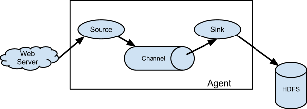

# Flume介绍
Flume是一个Apache旗下的一个分布式的日志收集，聚合以及数据转移的日志收集处理的框架。Flume提供了很多灵活的组件，供各种情况的使用，因此Flume的应用场景很灵活，比如

* 使用Flume进行实时计算

* 使用Flume进行离线计算

* 使用Flume作为数据出口

此外，Flume不仅仅可以作为日志的收集源，将日志汇入。也可以作为出口，然后进行`elk`之后再转移至`hdfs`或者`storm`中。

# 三大组件

Flume的组件主要分为三大块
* Source 流入数据，例如从一个具体`webserver`,`kafka`等获得具体的数据。
* Channel 缓存数据，直到数据被它的一个或者多个`Sink`消费之后，数据才会总`Channel`中删除。
* Sink 消费`Channel`中的数据，并且数据存储到外部的存储中，例如`hdfs`中。
