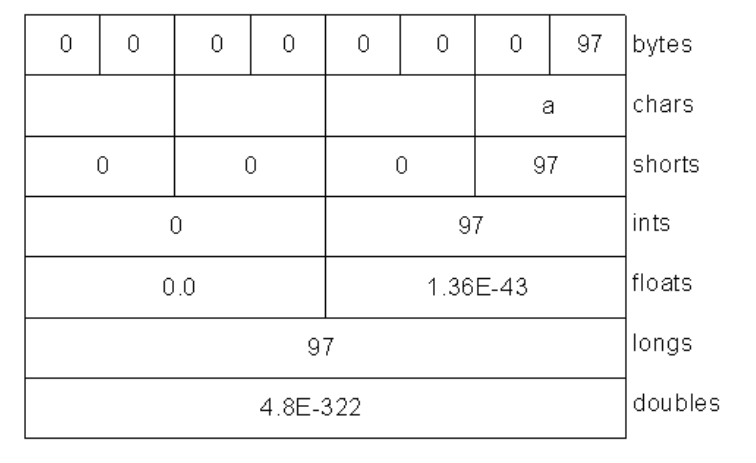
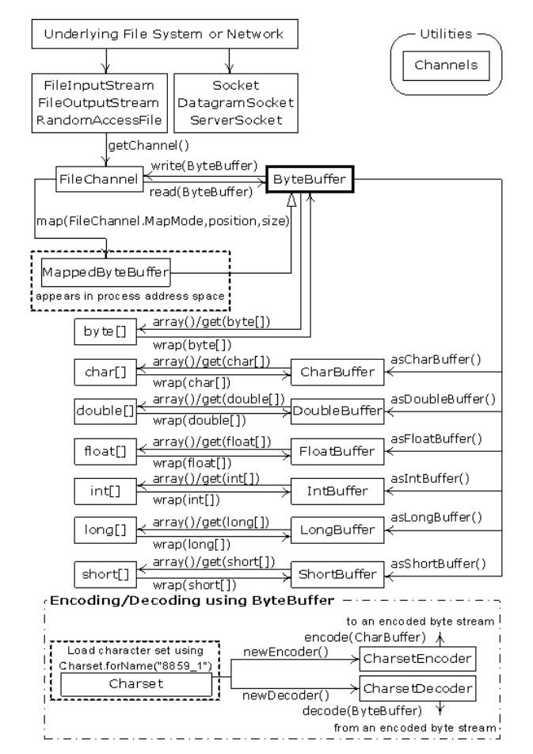
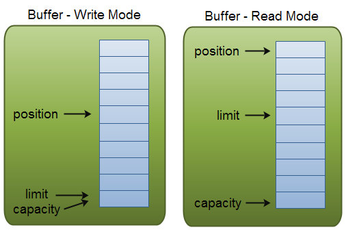

# 概述
NIO中有两大核心的概念，**Channel**和**ByteBuffer**。Channel就是数据传输的管道，ByteBuffer就是运送数据容器。举一个具体的例子，类似于矿场挖矿，新挖的矿石会把矿石放在传动带(Channel)上。然后矿石会被运输到翻斗车(ByteBuffer)中,当翻斗车装满之后或者我们想要矿石的时候，就可以把矿石运出去。NIO的逻辑也是如此，把数据放到Channel中，Channel会把数据放到ByteBuffer中，之后我们就可以通过操作ByteBuffer来操作数据了。**因此我们最主要的操作就是与ByteBuffer的操作，而不用直接操作Channel来进行IO**。

## 执行流程
`Channel`和`Buffer`的操作于流式IO有一定区别，流式处理时，strem只能是InputStream或者是OutputStream,不能同时处理读写。而Channel则可以通过Buffer同时处理读写操作。


# 基本使用样例

使用`FileChannel`读取数据，然后写到另一个文件中，实现文件拷贝

```
// 创建源文件的Channel和目标文件的Channel
FileChannel ifc = new FileInputStream("foo.txt").getChannel();
FileChannel ofc = new FileOutputStream("foo_copy.txt").getChannel();

// 创建ByteBuffer
ByteBuffer buffer = ByteBuffer.allocate(1024);

while(ifc.read(buffer) != -1){
    buffer.flip();
    ofc.write(buffer);
    buffer.clear();
}
```

* 在把`buffer`中数据写入文件之前，需要先调用`filp()`方法，切换`buffer`的模式，从读模式变为写模式，通知该ByteBuffer之后会进行写操作。
* 数据写完之后，调用`clear()`方法，清空`buffer`中的数据，然后供下一次读数据操作。

 
 # 数据编码

由于ByteBuffer容纳的是十分不同的字节，为了把数据转化成有意义的字符串，必须对数据进行编码。可以在数据**写入ByteBuffer是进行编码**也可以是在**从ByteBuffer中读数据时进行解码**
 
 * 写编码
 
```java
FileChannel channel = new RandomAccessFile("target/test-classes/data.txt", "rw").getChannel();
channel.write(ByteBuffer.wrap("哈罗NIO".getBytes("UTF-16BE")));
channel.close();

// 或者使用CharBuffer写入

FileChannel channel = new RandomAccessFile("target/test-classes/data.txt", "rw").getChannel();
ByteBuffer buff = ByteBuffer.allocate(1024);
buff.asCharBuffer().put("哈罗NIO");
```

* 读解码

```java
FileChannel finc = new FileInputStream("target/test-classes/data.txt").getChannel();
finc.read(buff);
buff.flip();
String encode = System.getProperty("file.encoding");
System.out.println(Charset.forName(encode).decode(buff));
```

## 读/写基础类型数据
* 写基础类型的数据的最简单的方式就是调用`asCharBuffer()`、`asIntBuffer()`等视图(view),然后调用`put()`方法插入数据即可

* 读数据使用相应的`getChar()`、`getInt()`等方法

```java
ByteBuffer buff = ByteBuffer.allocate(1024);
buff.asShortBuffer().put((short) 442);
System.out.println(buff.getShort());
```

# 视图缓冲器(view buffers)

视图缓冲器就是帮助我们方便地在`ByteBuffer`上操作各种数据类型的窗口，`ByteBuffer`是依旧是数据存储的地方。实际上`ByteBuffer`是通过包装一个8字节的数组产生的，然后使用不同类型的视图来操作不同数据类型的数据。从下图可以看到，在同一个`ByteBuffer`上如果使用不同的视图就会得到不同类型的数据。





# 缓冲器操作数据(Data manipulation with buffers)


## 缓冲器的细节
* buffer是有数据和访问四个访问数据的索引组成
    * position(位置)
        * 读模式下, position表示当前数据的位置，每次读取都会从postition指向的位置读数据
        * 写模式下, position表示当前可写数据的位置，每次写数据都会写入到position指向的位置
    * limit(界限)
        *  读模式下,limit标识最多可以读到多少的数据，每次在切换到读模式时，limit会被设置为position的值，然后position又被设置为0
        *  写模式下，limit表示可以写入多少数据，limit等于buffer的capacity
    * capacity(容量)　
        * capacity标识buffer的大小，无论在写模式还是在读模式，capacity的值是不会改变的
    * mark(标记)
        * mark是对buffer中打标记，可以调用reset()方法，回到mark标记的位置(position设置为mark的值)

* 下图可以很好的描述，在读模式下和写模式下，position,limit,capacity三者之间的关系


* 方法描述

方法 | 描述
-----|------
capacity() | 返回buffer的容量
clear() | 情况buffer中的数据
flip()|将limit设置为postion的值，然后把position赋值为0。主要用于从buffer读取写入的数据
limit()|获得limit的值
limit(int limt) | 设置limit的值
mark() | 将mark值设置为position
reset() | 将position设为mark标记的位置
rewind() | 将索引指向buffer的开始位置
position() | 返回position的值
position(int pos) | 设置position的值
remaining() | 返回(limit - position)的值
hasRemaining() | 如果有介于position与limit之间的元素，则返回true


# 内存文件映射(Memory-mapped files)

内存文件映射机制允许我们可以操作一些因为文件太大而无法被放入内存的文件，在使用机制去操作文件的时候。看似我们可以操作整个文件，但其实不是，因为只有一部分被放入了内存当中，其余的部分都被交换了出去。

* 读写数据样例
    * 为了支持读写功能，我们使用`RandomAccessFile`

```java
// 写数据
MappedByteBuffer mpBuff = new RandomAccessFile("target/test-classes/big_data.txt", "rw")
        .getChannel().map(FileChannel.MapMode.READ_WRITE, 0, length);
for (int i = 0; i < length; ++i) {
    mpBuff.put((byte) 'x');
}
// 读数据
System.out.println("Finishing write...");
for (int i = 0; i < length / 2; ++i) {
    System.out.println(mpBuff.get(i));
}
```

# 文件锁(File locking)

文件锁的目的就是帮助我们把文件当作一个共享资源，可以被不同的线程(进程)进行同步互斥的操作。文件锁是直接映射到了本地操作系统的加锁工具上的，**因此文件锁对操作系统的其他进程(非jvm进程)也是可见的。**

* 使用样例

```
FileOutputStream fos = new FileOutputStream("target/test-classes/lock_data.txt");
FileLock fl = fos.getChannel().tryLock();
if (fl != null) {
    System.out.println("Locked file");
    Thread.sleep(100);
    fl.release();
    System.out.println("Released Lock");
}
```

* lock方法解析


方法　| 描述
---|---
lock()| 阻塞调用，获得的锁会加在整个文件上
tryLock() | 非阻塞调用，获得锁会加在整个文件上
lock(long position, long size, boolean shared) | 阻塞调用，获得锁会在加载文件position到position+size的区域上
tryLock(long position, long size, boolean shared) | 非阻塞调用，获得锁会在加载文件position到position+size的区域上

## 对映射文件的部分加锁(Locking portions of a mapped file)

映射文件的方式经常用来操作大文件，应此会需要有多个线程(进程)操作统一文件的情况，这样就可以对文件的部分内容进行加锁，从而可以使多个线程(进程)同时操作同一个文件，而不用全文锁住文件，导致一个时间内只一个有线程(进程)可以访问操作文件。

* 样例

```java
public class FLock {
    private final static int LENGTH = 0x8FFFFFF;

    private static FileChannel channel;

    public void lockMMPFile() {
        try {
            channel = new RandomAccessFile("target/test-classes/lock_data.txt", "rw").getChannel();
            MappedByteBuffer buff = channel.map(FileChannel.MapMode.READ_WRITE, 0, LENGTH);
            for (int i = 0; i < LENGTH; ++i) {
                buff.put((byte) 'x');
            }
            Thread t1 = new Thread(new LockAndModify(buff, 0, LENGTH / 3));
            Thread t2 = new Thread(new LockAndModify(buff, LENGTH / 2, LENGTH / 2 + LENGTH / 4));
            t1.start();
            t2.start();
        } catch (IOException e) {
            e.printStackTrace();
        }
    }

    private static class LockAndModify implements Runnable {

        private ByteBuffer buff;
        private int start;
        private int end;

        public LockAndModify(ByteBuffer buff, int start, int end) {
            this.start = start;
            this.end = end;
            buff.limit(end);
            buff.position(start);
            this.buff = buff.slice();
        }

        @Override
        public void run() {
            try {
                FileLock fl = channel.lock(start, end, false);
                System.out.println("Locked: " + start + " to " + end);
                while (buff.position() < buff.limit() - 1) {
                    buff.put((byte) (buff.get() + 1));
                }
                fl.release();
                System.out.println("Released: " + start + " to " + end);
            } catch (IOException e) {
                e.printStackTrace();
            }
        }
    }
}
```
