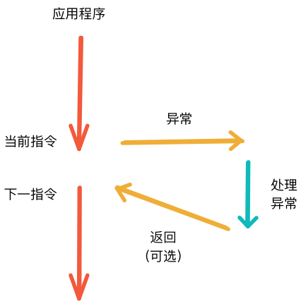
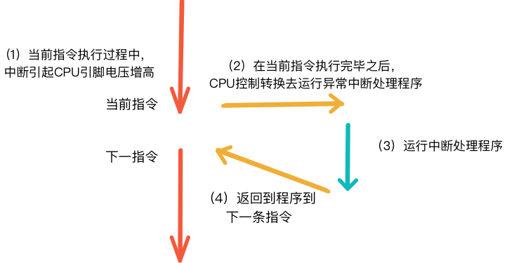
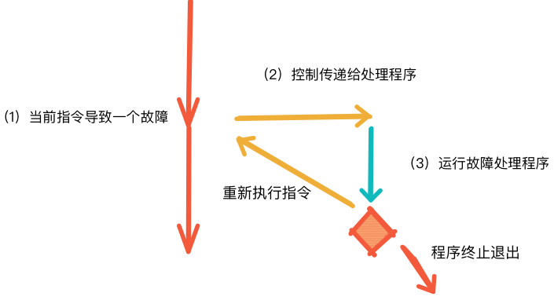

处理器处理指令的机制可以十分简单的看做一条接着一条的执行，这一条条的指令构成的序列，称为**逻辑控制流**。在我们的程序中，有两种方式可以改变这种控制流:**条件分支和函数调用**，但是这两种方式仅仅是作用于程序本身的控制，无法面对更加复杂的情况，例如：网卡中有数据到达、定时器的计时完成或者是在键盘上按下了ctrl-c等。那么为了应对这些复杂的情况，计算机中就提出了**异常控制流**的机制。
# 异常
异常是异常控制流的一中形式，它一部分有由件实现，一部分由操作系统实现。在这里我们讨论的异常和我们在Java中所讨论的异常并不是一种内容，这里的异常更多是为了让**处理器响应某种变化的机制**。通过下图来简要的描述一下异常：

CPU正在执行应用程序的指令，在执行到`当前指令`的时候，异常发生了比如网卡中有数据到达。这个时候CPU就会通过查找一张叫做**异常表**的跳转表，查看该异常应该调用哪个异常处理程序。接着异常处理程序处理完成之后，就会根据处理结果做出响应，有三种不同的响应：
* 重新执行异常发生时正在执行的指令，也就是*当前指令*。
* 应用程序直接执行后续指令，也就是*下一指令*。
* 应用程序终止退出。

从这几种返回结果便可以看出，异常处理机制和函数调用机制十分不同，函数调用机制的返回就像是异常机制的一个子集。一般来说异常可以分为四类：中断（interrupt）、陷阱（trap）、故障（fault）、终止（abort），下表是分别对这些类别的总结：

类别 | 原因 | 异步/同步 | 返回行为
--- | ---  | ---     | ---
中断|来自I/O设备的信号|异步|总是返回到下一条指令
陷阱|有意的异常|同步|总是返回到下一条指令
故障|潜在可以恢复的作物|同步|总是返回到当前指令
终止|不可恢复的错误|步同|不会返回

## 中断
中断是在所有异常中唯一的异步发生的，它是由处理器外部设备发出的，而不是由任何一条硬件指令造成的。例如网卡中有数据到达、磁盘找到目标数据、定时器计时时间到等都会向CPU发出一个中断信号造成中断，使得CPU去处理异常。

让CPU感知到异常到来的方式都是通过其他外围硬件设备引起CPU的某一引脚的电压增高，从而让CPU在执行完当前指令之后，控制转换去中断处理行为。

## 陷阱
陷阱是一种同步的异常，它更像是一种有意的行为。陷阱最主要的用途便是让进程在**用户态**和**内核态**之间切换，这一切换过程便是系统调用，例如，创建进程(fork)、读文件(read)等。如过从我们这些程序员的角度去看陷阱异常的返回机制，它其实就普通的函数调用一样，最后都会返回到下一条指令处。举一个具体的例子:
```
Ltmp2:
    movq	%rsp, %rbp
    callq	_fork
    xorl	%eax, %eax
    popq	%rbp
    retq
```
在这里，假设用户调用了`fork`函数用于创建进程，系统实际上会执行`_fork`函数，使得当前进程进入内核态，最后通过`syscall`调用相应的汇编指令创建出新的子进程。

## 故障
故障异常相对来说比较特殊，因为它要根据故障处理程序是否能成功的解决故障而决定返回的情况。如果故障能够被解决那么就会再执行一遍引起故障的指令，如果无法解决那么应用程序就会终止退出。

一个十分经典的故障便是**缺页故障**，当指令引用一个虚拟地址时，而相应地址的数据并不在内存中的时候就会引起缺页故障。这是故障处理程序就会从磁盘中去取出相应的数据，接在再重新执行指令，这个时候引用的数据已经存在于内存中了，就不会再引起故障了。

## 终止
最后一种是终止异常，它一般都是有不可恢复的致命错误导致的结果，通常来说是硬件错误，比如DRAM或者SRAM位被损坏时发生的奇偶错误。碰到终止异常后，终止处理程序处理之后不会将控制权返换给应用程序而是将控制权交给一个`abort`程序，这个程序最终会停止应用程序。

# 总结
此篇内容主要是对四中异常的介绍，在此基础上会引申出非常多的知识点，这些知识点我们可以通过在学习Linux系统的调用的时候一一学习到。了解异常可以帮助我们在日后掌握理解并发、应用程序和操作系统交互甚至是在编写有意思的应用程序时提供帮助。