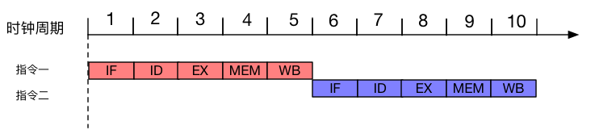
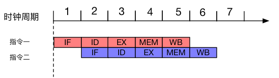
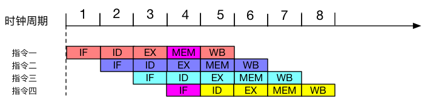
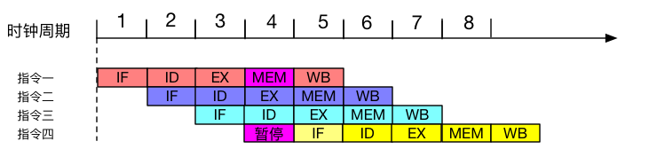
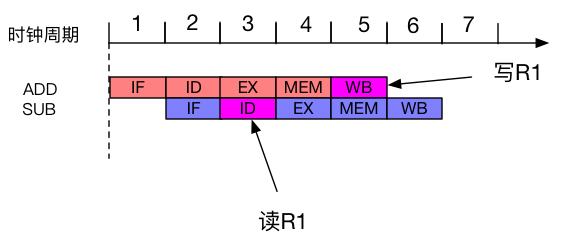
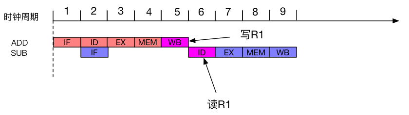
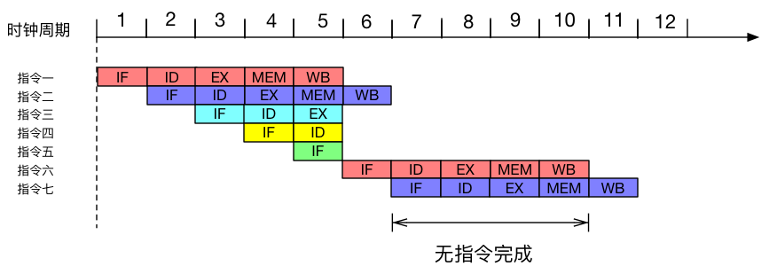

在学习内存屏障先关内容的时候，总是会说编译时期的指令重排序或者运行时期的乱序执行，是为了提高运行效率。但是为什么就这样子就可以提高效率呢，停下来翻看一些资料，原来这块的东西居然和指令流水线有关。于是此篇就来讲讲指令流水线，也算是弥补一下研一当年没有听懂的课。

# 指令流水线就是流水线
不要被指令流水线听起来高大上的名字吓到了，其实什么指令流水线和我们说的工厂的流水线是一回事情，工厂中一个产品的装配可以被分成很多个阶段，这样的好处就是在于一个时间段，可以同时进行不同产品的装配。同样的的道理，CPU中的产品就是一条条的指令，指令的执行可以分为很多种不同阶段，比如说我们就可以将这些阶段分为：
* 取指（IF）：从内存中取出一条指令并存放在高速缓存中。
* 指令译码(ID)： 指令译码，读寄存器。
* 执行指令(EX)：真正执行指令的操作。
* 写操作数(MEM)：访问内存。
* 写寄存器(WB)：结果写回寄存器。

在这里我们将指令分为了五个阶段，称为五级流水线，当然不同的CPU的指令级架构划分指令阶段的方式各不相同，这就和工厂一样，同样是造汽车福特和本田就有可能采用不同的方式来组装的他们的汽车。**每个阶段后面会会跟着一个英文简写，目的是为了方便叙述，可以当做字典，一下子想不起来就可以回到这里看看。**

## 顺序执行与流水线执行
接下来就比较CPU以流水线执行指令和顺序执行指令有什么优势，我们先假设每一个阶段都只需要一个CPU时钟周期就可以完成也不考虑冲突问题。并且有两条指令，这两条指令的执行都需要经过这五个阶段。那么顺序执行的情况就是：

可以看到执行两条指令CPU一共花了10个时钟周期，假设一个时钟周期是一秒，也就是说要花10秒才能执行完。如果采用流水线的方式，花费时间就完全不一样了。

花费时间从原来的10个时钟周期减少到6个时钟周期，仅仅6秒的时间就可以了。这是因为在使用流水线方式执行的时候，同一个时间周期内可以同时执行好几个阶段。比如第二个时间单元，就可以同时执行指令一的译码(ID)和指令二取值(IF)，而在顺序执行时，指令二就必须等到指令一完成之后才能继续执行。

# 指令流水线的影响因素
上面介绍了一下什么是指令流水线，也举了个例子比对了一下指令的顺序执行和流水线式执行的区别。但是其实在现实情况中还有一些因素会影响流水线的流转，导致流水线也不那么的流畅。

## 结构相关
结构相关因素主要是用于硬件资源引起的，当有多条指令进入流水线时，不同指令争抢同一功能部件，就会造成资源使用冲突。我们知道指令和数据都是存储在内存当中的，且内存只有一个访问接口，那么当同一时钟周期内，一条指令需要将运算结果写入内存，而另一条指令则需要访问内存获取操作数，这时就会发生访问冲突。举个例子：

在第四个时钟周期（紫色标注阶段），指令一和指令四都需要去访问内存，此时就会产生冲突，因为不可能同时满足两条指令的要求。那么为了解决这种硬件结构相关的问题，也有两种解决方式。

### 增加功能部件
硬件的问题最直接的就是可以用硬件来解决，我们可以设立两个独立的内存，分别用于存放指令和数据。也可以采用一种叫做指令预取技术，设置一个指令队列，将指令提前的先放在CPU指令队列中缓存，那么当下一次需要指令的时候就可以直接从缓存中取指而不是访问内存。

### 阶段暂停
既然是同时访问一个竞争资源出现了问题，那么还可以采用暂停的办法。流水线可以在完成前一条指令内存访问后暂停一个时钟周期，然后再进行另一条指令的取指操作。

上图就是描述了这种方式，第四个时钟周期的时候，指令四并没有去执行取指(IF)，而是暂停了一下等到下一个周期再去执行这个操作，这样就很好避免的这种结构冲突问题。

## 数据相关
影响流水线的还有数据相关因素，例如说这么两条指令
```asm
ADD R1, R2  # R1 = R1 + R2
SUB R3, R1  # R3 = R1 + R3
```
要计算R3必须先要计算R1，R1的结果是由`ADD`指令得来的。在顺序执行的情况下，这种先后的读写顺序是不会有任何问题的，但是如果放到流水线当中，用于操作阶段的重叠，这种读写顺序就不能保证了。比如：

在第五个时钟周期的时候，`ADD`指令才会把结果写到寄存器中，但是在第三个时钟周期时`SUB`指令就要从寄存器R1取数了，这个时候就发生了**先写后读(RAW, Read after Write)**冲突，如果说不做什么措施，最终肯定会导致结果出错。

### 后推法
同阶段暂停类似，既然这种数据相关冲突产生的根本原因就有数据依赖性，那么可以依旧采用暂停法。将后续需要数据的阶段等待依赖阶段完成之后再继续执行，如下面所示

把`SUB`指令的读寄存器阶段后推了3个时钟周期，到第6个时钟周期才执行，这样子就能保证`SUB`看到的R3就是存放的最新的数据。

### 定向技术
但是也很明显，采用后推法必然会导致CPU部件资源的浪费，因此又提出了`定向技术`，或者叫做旁路技术、相关专用技术。核心的思想就是，指令不必等待某条指令将结果写回寄存器之后，再从寄存器中取数，而是直接把将执行结果发送给需要该结果的指令。比如，我们一直说的这个`ADD`和`SUB`指令，其实`ADD`指令的结果，在`EX`阶段的末尾就已经生成了，如果采用这种定向技术，这个结果就可以直接发送给`SUB`的`EX`阶段，用于运算，这样子就可以避免后推法带来的流水线停顿了。

## 控制相关
最后就是控制相关因素，也就是我们的条件分支，这一类也是影响流水线的主要因素，而且也是会让流水线丧失很多的性能。我们一图来说明这个问题。

假设指令二是一条跳转指令，它必须等到指令一的结果出现后（第五个时钟周期）才能决定是执行指令三后续的指令还是指令六后续的指令。默认的话就会将指令三及其后续指令加入流水线中，但是当最终结果使得PC指向了指令六，这就导致指令三，四，五已经做的操作将全部作废，重新开始执行指令六。这也最终导致了在第七到第十的始终周期内，没有一条指令完成，这就是控制转移带来性能损失。当然为了解决这种问题，也会相应的办法去解决，具体就不一一讲述了，在此罗列一下办法，感兴趣的可以去详细了解：
* 尽早判别是否发生转移，生成转移目标地址。
* 通过预取成功与不成功两种控制流上的指令。
* 提前生成条件码。
* 提高分支预测成功正确率等。

# 总结
到此为止就大致聊完了指令级流水线是什么和影响流水线运行性能的因素，也正是因为有了流水线才会发展处乱序执行，让CPU根据吸现有的资源重新安排指令的执行顺序，这也就是为什么说乱序执行可以提高效率。也许什么流水线在平时工作中完全不会用到，这些内容就当是小知识，涨涨眼界吧。