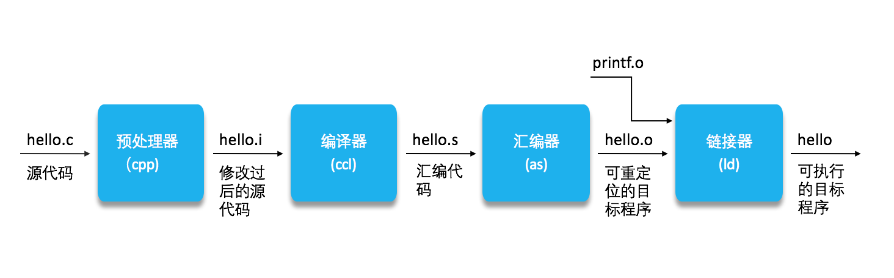
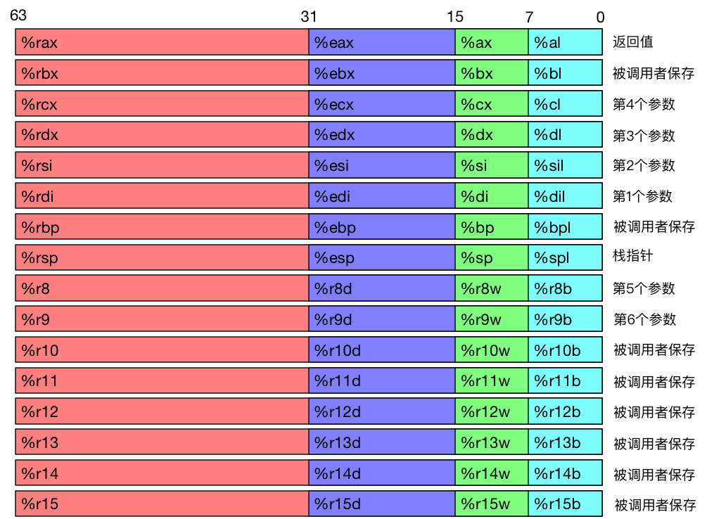
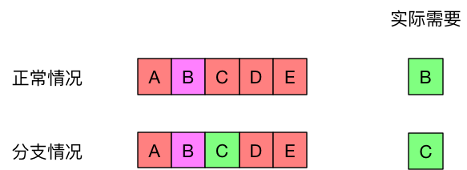
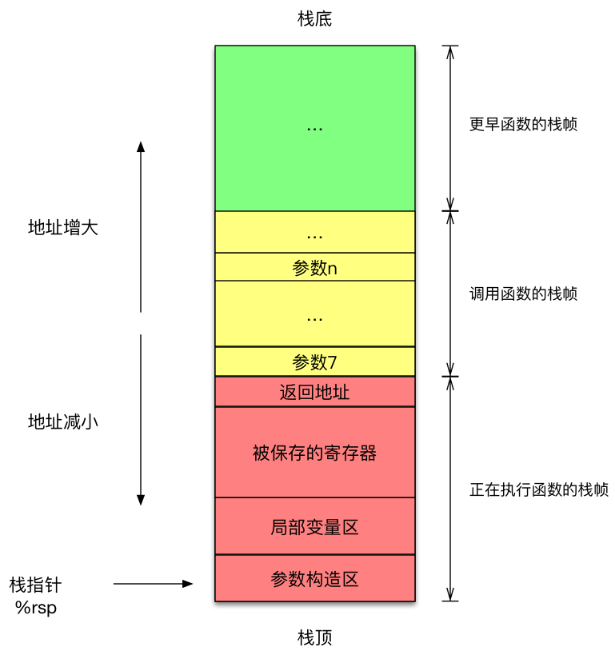
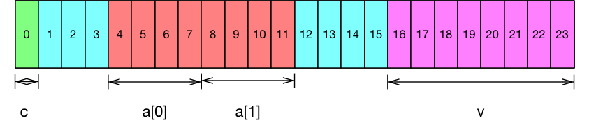
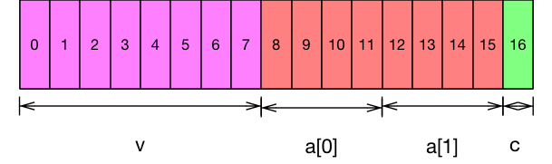

计算机只能看懂0和1，那么我们平时写的代码是怎么如何变成这些0和1的呢？计算机又是如何根据这些我们读不懂的0和1组合运行的呢？那我们又有没有办法去学习计算机是如何执行我们写的程序的吗？所以这一次让我们通过01组合（机器码）的代言人——汇编，来研究一下这些有意思的问题。通过这次深入学习，我们将会学习到平时我们写的代码是如何转换成为只有计算机认识的机器码，什么又是汇编；接着我们再看看日常写的条件判断、循环、函数调用又是怎么实现的；最后呢，我们将研究一下数组、结构体、联合这些数据结构又是怎么存放的，以及经典的缓冲区溢出问题。好了，现在且听我娓娓道来吧。

# C，汇编，机器码的关系
首先我们先来看看c，汇编，机器码这三者的关系，探究清楚了这个关系我们也就搞清楚了第一个问题——我们写的代码是如何转换成机器码的。日常当我们写完一段惊天地的`hello world`时，为了运行代码我们就必须先去编译它，然后我们就会执行这样的令命：
```shell
linux> gcc -o hello hello.c
linux> ./hello
```
当我们使用了这样命令，GCC编译器驱动程序就会读取hello.c的内容并把它翻译成可执行机器码，也称为**目标文件**。这个翻译过程可以分为4个阶段。


* 预处理器阶段
第一步的预处理阶段就是根据以字符#开头的命令，修改原始的c代码。例如`#include<stdio.h>`，就是通知预处理器把系统头文件stdio.h的内容插入到原始的c代码中，最后得到一个修改过的c代码文件hello.i。

* 编译器阶段
在编译阶段，编译器会把hello.i在翻译成我们的今天的主角，汇编代码文件(hello.s)。

* 汇编器阶段
然后进入汇编阶段，汇编器就会把hello.s的汇编代码内容翻译成二进制机器码，并且会把这些机器码打包成一个**可重定向的目标程序**，hello.o。

* 链接阶段
终点站链接阶段，链接器就会把其他目标文件以某种方式合并到我们的hello.o中。在我们的hello world实例中，调用了printf系统函数，编译器就会帮我们找到printf.o这个目标文件然后合并进去。

经过了上面这4步，我们才最终得到了可执行的目标程序，然后通过命令`./hello`就可以看到我们惊天地泣鬼神的hello world了。从这4个步骤里面看到汇编代码之后就是二进制机器码了，汇编代码也是最接近机器码的角色。不仅如此，读懂了这4个步骤也就可以回答了我们的第一个问题，高级语言的代码是如何翻译成机器码的，同时也引出了汇编。那么接下来，就让我们来看看汇编是一个什么好玩的东西。

# 陌生的汇编
要说汇编，其实应该这么来形容汇编，汇编其实是人可以看得懂的机器码。既然汇编是机器码代言人，那么就必然和硬件有着千丝万缕的联系，事实也的确如此。在这里我们介绍的是x86-64指令级架构（Instruction Set Architecture, ISA）上的汇编指令，它也是们现在接触的最多的指令级结构，除此之外的还有ARM架构等。

## 看不见的CPU
学了c学java，学了java学Python，不论我们怎么折腾，都会觉得似曾相识，但当我们看到汇编时候却不会有这种感觉，毕竟汇编是机器码的代言人，是人类能看懂的机器码。此外在用高级语言的时候，CPU内部的东西其实对于我们来说是不可见的，但是到了汇编级别则不是，有些部分还是需要我们掌握之后才能好好地看看汇编，这些地方包括：
* 程序计数器。用于指示下一条需要执行的指令在内存中的地址。
* 寄存器。用于存储数据，以便CPU的运算处理。
* 条件码。表示最近一次的算术或逻辑指令的运算状态，后续在研究条件判断的时候，可离不开它们。

了解这些CPU内部的东西，是我们搞清楚汇编的第一步。程序计数器相对来说十分的好理解，一眼便知，但是寄存器和条件码却不是我们一下子就能明白东西，在这其中我们还需要着重的去看看寄存器和条件码又是怎么一回事情，才能为我们后面做好铺垫。

## 寄存器
寄存器是CPU的一部分，在x86-64的CPU当中包含了16个可以存储64位（8字节）的通用寄存器，这些寄存器可以用来存储整数数据和指针。至于浮点数与整数拥有一套类似的指令级和寄存器，就不在过多赘述。下面就让我们来看一下到底又哪些寄存器，我们不需要记住，但是把它当做地图看，需要的时候回来一查便知。

从图中可以看到这些寄存器有着自己的作用，比如说%rsp寄存器就是专门用来存放栈指针的，%rcx，%rdx等用于函数的参数传递等。不仅如此在图上还可以看同一类中还标不同的颜色，这是由于历史的原因，在指令级演化的过程为了保证向后兼容所产生的。可以根据其所支持的位数不同，而分为4种：64位，32位，16位，8位。

## 条件码
此外寄存器不仅可以存储整数和指针，还有一部分转用于记录**最近**运算的状态。例如是否溢出，是否进位，结果是否为零等。最常用的条件码有：
* CF: 进位标志。记录最高位是否发生进位。可用于判断无符号数是否溢出。
* ZF: 零号标志。记录结果是否为0。
* SF: 符号标志。记录最近操作的结果为负数。
* OF: 溢出标志。最近的操作数导致补码溢出（正溢出或负溢出）
条件码看起来只用这么点，但是配合我们的汇编的指令就可以得到各种状态组合，这对于我们的程序来说就是条件判断呀。讲到这里我们的汇编朋友也迫不及待出来和大家见面了。

## 你好汇编
我们的汇编大致来说可以分为三类：存取数据类，算术和逻辑运算类，控制类。而且汇编指令其实很简单，包括一个指令和零个或者多个操作数。
```
指令 （操作数1，操作数2，操作数3...)
```
所有指令都是参照这种格式来书写，现在就让我们分别来认识认识汇编。

### 存取数据类指令
存取数据类指令，顾名思义就是把数据从源地点移动到目标地点，在这里交互的地点一般只有寄存器和内存。
#### mov
先让我们讲讲第一大块`mov`指令，通过几个例子来慢慢深入
```assembly
movl $0x4050, %eax          将立即数（常数）存入寄存器
movw %bp, %sp               将bp寄存器上的值存到寄存器sp中 
movb (%rdi, %rcx), %al      以%rdi+%rcx的值作为地址，将相应内存址上的值存入%al
movb $-17, -12(%rbp)        将立即数-17，存入-12+%rbp为内存地址的内存上
movq %rax, -12(%rbp)        将寄存器%rax中的值，存入-12+%rbo为内存地址的内存上
```
可以看到每个`mov`指令后面都带了一个后缀字符(b，w，l，q)，其实这代表了操作数的位数，还记得我们同一功能的寄存器会根据位数又分化出来不同部分吗，这里就用到了。b匹配寄存器的8位的部分，w位16位，l为32位，q为64位。此外，在指令中我们可以看到有带着$符号的数字，在汇编中他们被称为立即数，也就是常数。因此我们看第一条指令`movl $0x4050, %eax`，就十分的好懂了，就是把一个16进制的数0x4050存放到寄存器%eax(32位)处，同样的第二条指令也就更好理解了。看到第三条指令，会发现`(%rdi, %rcx)`这样一串字符，其实这里的意思就是定位内存上的某一位置，那么具体又是怎么定位的呢，这里就需要引入*通用寻址公式了*:
$$addr = Imm(r\_b, r\_i, s) = Imm+r\_b+r\_i\cdot s$$
其中Imm为立即数， $r\_b$和$r\_i$都为寄存器的值，s为一个比例因子，任何一个方位内存方式，都会采用这种方式来计算地址。所以可以看到`(%rdi, %rcx)`表示的就是%rdi+%rcx，那么这条指令的意思就一下子跃然纸上了，以及第四第五条的`-12(%rbp)`就是计算-12+%rbp的值。

#### pushq/popq
我们存取数据类指令第二种就是`pushq`和`popq`，想必看到他们就会想到他们和栈有关系。答案也确实如此，这两个指令就是数据放到栈上，例如`pushq $8`就是把一个立即数8放到栈空间上，至于栈的内容我们会在后面的函数调用这一块细讲。

#### leaq
最后是我们的`leaq`指令（加载有效地址），它的指令和`mov`很类似会去引用一块内存，但其实它并没有去找内存，而仅仅**计算了地址**。例如：
```
leaq 12(%rdi,%rsi,4), %rax
```
这条命令并不是说把内存地址为12+%rdi+%rsi*4上的内容放入%rax，而只是将这计算结果放到%rax寄存器中。为什么会有这样的东西，比如说我们的c代码有这样的内容：
```c
int* y = &x;
```
把x的地址赋给指针y，我们不是把x赋给y，而是把x的地址赋给y，那么这个时候就会通过`leaq`的指令来计算x的内存地址。

总的来说学习存取类指令，知道它的意思，明白数据从什么地方转移到什么地方，后缀字母代表的意思，以及牢记通用寻址公式的使用。此外还有`movz, movs`这一类的内容就不再讲述，可以通过自行查阅学习。

### 计算类指令
计算机肯定需要计算，那么这些算术和逻辑运算又是什么呢，无非就是加减乘除和移位操作。

#### 一元操作指令
一元操作就是操作数的个数只有一个，它既是源又是目的地。这个操作数可以是一个寄存器，也可以是一个内存位置。比如
```
incq(%rsp)
```
将栈顶的8字节元素加1，这种方式类似我们经常写`x++`或者`x--`。不仅如此还有其他一元操作的逻辑运算指令，下面就列出常用的指令
```
INC D 加1
DEC D 减1
NEG D 取反
NOT D 取补
```

#### 二元操作指令
除了一元操作，必然还有加减乘除需要两个操作数，以及逻辑运算和位移操作肯定也需要两个操作数，不仅如此它们也会根据需要操作的数据的位数，同一功能的指令会有4类(b，w，l，q)。下面就是最常用二元指令
* 加减乘除
```
ADD     S, D    加 D=D+S
SUB     S, D    减 D=D-S
IMUL    S, D    乘 D=D*S
```
* 逻辑运算
```
XOR     S, D    异或 D=D^S
OR      S, D    或 D=D|S
AND     S, D    与 D=D&S
```
* 位移操作
```
SAL     k, D    算术左移 D=D<<k
SAR     k, D    算术右移 D=D>>k
SHL     k, D    逻辑左移
SHR     k, D    逻辑右移
```
这里还需要注意的就是算术位移和逻辑位移的区别，区别就在于**算术位移填上符号位**，**逻辑位移填充0**。

### 控制类指令
终于来到我们的控制类指令了，还记得我们之前说的条件码吗？在这里就要大显身手了。

#### cmp/test
我们条件码的值都是记录最近一次运算的状态，但是如果当我们只想比较一下两个数的大小，而不是真的想做减法操作时，或者说又想执行一下逻辑运算，`cmp`指令和`test`指令就是为此而生的。
```
cmpb     S, D    比较8位
cmpw     S, D    比较16位
cmpl     S, D    比较32位
cmpq     S, D    比较64位 

testb    S,D     测试8位
```
上面这些指令并不会真正修改寄存器中的值，只是会修改条件码值，`cmp`指令其实就是`sub`指令，但是不会将覆盖寄存器中的值，同样的道理`test`命令也是，它就是相当于`and`指令。

#### jmp
除了上面这两种指令，还有一种跳转指令，通过这种跳转指令**配合各种条件码的组合**就能够实现我们多种多样的条件判断了。例如：
```
    movq $0, %rax
    jmp .L1
    movq (%rax), %rdx
.L1
    popq %rdx
```
这些指令在运行的过程当中，当遇到了`jpm .L1`指令就会直接跳转去`.L1`标签之后的指令了，而不会去执行`movq (%rax), %rdx`这条指令了。这就是跳转指令的能力，十分类似与C语言中的`goto`关键字的功能。此外，配合上条件码我们就可以实现有条件地跳转了，例如指令`jne .L1`的意思就是如果条件码`ZF`不等于0，那么则跳转去执行`L1`出标记的指令。当然除了这两个指令之外还有很多配合条件码的跳转指令，这里不会一一列出，会在后面碰到的时候在具体解释含义，如果有兴趣可以自己去查阅一下。

# 条件分支和循环
基础的汇编内容终于完了，十分的琐碎，但是不得不去掌握一下，有了这些基础我们就来来讲讲计算机是如何实现`if/else`、`while`、`for`和`switch`这些条件判断和循环的。

## if/else的实现
我们先来看一个列子，看看C语言的`if/else`是怎么变成汇编的：
```c
long absdiff(long x, long y) {
    long result;
    if (x > y)
        result = x-y;
    else
        result = y-x;
    return result;
}
```
然后下面就是没有经过编译器优化的，对应的汇编代码。其中变量x，y分别保存在了寄存器%rdi和%rsi中，%rax用于保存返回值。
```
absdiff:
    cmpq    %rsi, %rdi
    jle     .L4             # 小于或等于，相当于判断是否 x <= y
    movq    %rdi, %rax
    subq    %rsi, %rax
    ret
.L4:    # x <= y
    movq    %rsi, %rax
    subq    %rdi, %rax
    ret
```
从汇编代码中看到，第二行指令先比较了%rsi，%rdi中值的大小，然后又根据条件码的情况指令`jle`跳转指令，如果%rdi的值小于等于%rsi的值，那么就会跳转去允许.L4标记的指令，否则就继续往下执行。考虑到汇编形式的指令不是很直观，我们可以将它转换成为使用goto语句的C语言代码。
```c
long absdiff_goto(long x, long y) {
    long result;
    int ntest = x <= y;
    if (ntest) goto Else;
    result = x-y;
    goto Done;
Else:
    result = y-x;
Done:
    return result;
}
```
这种解释方式就会变的十分的一目了然，一般来说在C语言中，条件判断的通用模式是这样子的：
```c
if (test-expr){
    // then-statement
} else {
    // else-statement
}
```
对于这种通用模式，汇编通常会使用下面的这种形式来翻译（使用goto语句C语言来表示)
```c
t = test-expr;
if(!t) {
    goto Else;
}
then-statement;
goto Done;
Else:
    else-statement;
Done:
    done-statement;
```
上面的这种条件分支汇编方式是基于**条件控制**实现的条件分支，虽然这种机制简洁明了，浅显易懂，但是在现代处理器上，它就有可能会变得十分的低效。

### 条件传送实现条件分支
在说这个内容之前，我们通过一个简单的例子看看为什么上面的这种实现是低效的。因为在我们的CPU中都是依靠流水线来执行指令的，如下图所述，在没有分支条件的情况下，当执行步骤A的时候，与步骤B相关的数据就会同时加载到寄存器中，这样的好处就是步骤A结束后就可以立即执行步骤B，而无需等待数据的加载。但是当有分支条件的情况的时候，执行完A后发现后续需要的执行的步骤C，但是实际加载的是B的数据，因此CPU就必须清空流水线，重新加载C的内容。这就是为什么使用**条件控制实现的条件分支**，在现代CPU是低效的。

为此大牛们常常会使用**分支预测技术**来解决这一问题，这个内容不展开讲，有兴趣可以自己的研究翻看。除了这种方式外呢，还有一种解决这种问题的办法就是使用**条件传送**实现条件分支。这种情况下我们可以先计算出两种条件的结果然后存放起来，在根据相应的判断条件，返回结果即可。这个时候就从先判断后计算结果，变成了先计算结果在判断，这样就避免了上面所述的这种问题的情况。还是以之前的C代码为例，这种方式的翻译方法就变为
```c
long result = y - x;
long else_result = x - y;
long ntest = x >= y;
if (ntest) {
    result = else_result;
}
return result;
```
可以很明显的看到这里没有goto语句，自然也就提供了流水线效率。但是这种基于条件传送的实现方式也有一定的限制：
* 两种分支的计算要尽量的简单，不然得不偿失，因为毕竟计算了两种结果，而不是一种。
* 涉及指针操作的时候，如 `val = p ? *p : 0;`，因为两个分支都会被计算，所以可能会出现奇怪的问题。
* 分支结果具有副作用，例如都修改了某一个值，如`x = 1`是if条件的语句，`x=2`是else条件的语句，那么势必最后的结果是有问题。

## 循环的实现
有了上面的基础，我们来快速的看一下循环的实现，先是我们不常用的do-while形式的循环。

### do-while循环
普通的C语言版本和goto语句的版本如下：
```c
// 普通版本
long fact_do(long n) {
    long result = 1;
    do {
        result *= n;
        n -= 1;
    } while(n > 1)
    return result;
}

// goto版本
long fact_do_goto(long n) {
    long result = 1;
loop:
    result *= n;
    n -= 1;
    if (n > 1) { 
        goto loop;
    }
    return result;
}
```
然后是相对应的汇编代码，在%rdi中存的是变量n的值
```
fact_do:
    movl    $1, %eax               # long result = 1
.L2:
    imulq   %rdi, %rdx             # result *= n
    subq    $1, %rdi               # n -= 1
    cmpq    $1, %rdi               # if (n > 1)
    jg      .L2                    # goto loop
    ret                            # return result
```
将他们转成通用形式的goto代码就是
```c
loop:
    body-statement;
    t = test-expr;
    if(t){
        goto loop;
    }
    return;
```

### while的实现
while循环的形式和do-while类似，甚至提高优化级别还可以将while翻译为do-while的形式，while循环的通用模式为：
```c
while(test-expr) {
    body-statement;
}
```
然后我们采用一种叫做**跳到中间**的方式来翻译while循环
```c
// goto版本
    goto test
loop:
    body-statement
test:
    t = test-expr
    if(t) {
        goto loop;
    }
```
此外提高编译的优化等级(`-O1`)，使用**guarded-do**方式就可以将while翻译成do-while的形式。
```c
// goto版本
t = test-expr
if(!t) {
    goto done;
}
loop:
    body-statement;
    t= test-expr;
    if(t) {
        goto loop;
    }
done:
```

### for的实现
循环中的还有一个就是我们用的比较多的for循环，for循环其实就是while循环的形式，然后根据编译的优化等级决定使用**跳到中间**还是**guarded-do**方式来翻译while循环。在这里就直接给出for循环转换成while循环的形式。
```c
// for
for (init-expr; test-expr; update-expr) {
    body-statement;
}

// while
init-expr;
while (test-expr) {
    body-statement;
    update-expr;
}
```

## switch的实现
最后来看看最复杂的switch语句的实现，switch可能包含多种跳转路径，面对这种情况就会使用**跳转表**来解决，简单来说就是一个数组，里面的元素是某种情况下需要的执行的代码地址。这里我们用一个具体的例子的解释：
```c
void switch_eg(long x, long n, long* dest) {
    long val = 1;
    switch(n) {
        case 1:
            val *= 13;
            break;
        case 2:
            val += 10;
        case 3:
            val += 11;
            break;
        case 4:
        case 6:
            val *= val;
            break;
        default:
            val = 0;
    }
    *dest = val;
}
```
这个例子而且还相对有几个比较特殊的点：
1. case2执行完还会执行case3。
2. case5, case6执行同样的代码。
3. 没有case4的情况。

那么汇编又是怎么样的呢
```
switch_eg:
    movq    %rdx, %rcx 
    cmpq    %6, %rsi
    ja      .L8
    jmp     *.L4(, %rdi, 8)  
.L3: # case n = 1
    leaq    (%rdi, %rdi, 2), %rax   
    leaq    (%rdi, %rax, 4), %rdi   
    jpm     .L2
# 其他情况逻辑
....
.L8: # default
    mol     $0, %edi
```
可以看到第四行指令，发现如果比较结果大于6，就去执行L8的指令，也就是default情况下的代码。再看第五行，当值小于6，**使用了间接跳转`*.L4(, %rdi, 8)`,通过利用地址计算公式，得到具体的地址来查找L4表，从而定位到需要指定代码的内存位置**。相对应的跳转表就是这个样子的：
```
    .section .rodata
    .aligin 8
.L4
    .quad   .L8 # case n = 0
    .quad   .L3 # case n = 1
    .quad   .L5 # case n = 2
    .quad   .L9 # case n = 3
    .quad   .L8 # case n = 4
    .quad   .L7 # case n = 5
    .quad   .L7 # case n = 6
```
举个例子，比如n=3（n存放在%rdi中）， 那么`L4(, %rdi, 8)`就等于L4+ 3 * 8，意思就是从L4的起始地址向下移动3个8个字节也就是L9的代码地址，这样子就能解决switch这种多分支情况的问题了。至于为什么变比例因子是8，其实很简单因为我们是64位系统，要表示所有的地址当然就需要8个字节(64位)。

# 函数调用
讲完了条件分支和循环在计算机是如何实现的，这一块就来来讲讲最有意思的过程调用，也就是我们平常写的函数调用是怎么实现的。最终我们需要去理解这么三个点的知识：
1. 控制传递。函数A是如何调用函数B，又是怎么返回函数A的。
2. 参数传递。函数A是如何向函数B传递参数的，函数B又是怎么返回结果的。
3. 内存管理。函数是怎么分配内存的，又是怎么释放内存的。

要学习这三个点，我们的需要先去了解一个东西，也就是栈。

## 运行时栈
所谓的栈就是一块内存区域，它专门用于管理函数的调用关系，因为栈的这种先进后出的特性正好用于函数调用关系的管理。在x86-64架构下的栈，**栈顶的地址越小，栈低的地址越大**.从下图中还可以看到**栈指针（%rsp)**专门用于记录栈顶的位置

栈指针减小一个适当的量就可以为数据在栈上分配空间，相反就可以通过增大帧指针来释放空间。此外，栈中每一个函数都会有一个栈帧，它是具体描述函数调用关系的数据结构，里面会包含返回地址，局部变量，参数等数据。

## 控制传递
下面就来讲一讲函数调用和返回是怎么实现的。当函数A需要调用函数B时，其实仅仅是将PC（程序计数器)设置为函数B代码开始的地方，同样返回就是将PC又修改成函数A后续需要执行的代码地址。但是关键就在于这里，CPU在调用函数B的时候就必须记录返回的代码地址。因此在x86-64机器中，提供了一个`call label`指令，它会将返回地址A压入栈中，也就是在上图中看到的**返回地址**这一块的内容。与`call`相对应的便是`ret`返回指令，它会将PC修改为之前压入栈中的返回地址。那么通过`call`与`ret`指令的配合，就可以实现函数调用，也就是控制传递了。下面就是一个例子
```
// multstore 函数
void multstore (long x, long, y, long *dest)
{
    long t = mult2(x, y);
    *dest = t;
}
// mult2 函数
long mult2(long a, long b)
{
    long s = a * b;
    return s;
}
```
与之对应的汇编
```
0000000000400540 <multstore>:
    # x存在%rdi, y存在rsi, dest存在%rdx
    400540: push    %rbx            # 通过压栈保存 %rbx
    400541: mov     %rdx, %rbx      # 保存 dest
    400544: callq   400550 <mult2>  # 调用 mult2(x, y)
    400549: mov     %rax, (%rbx)    # 结果保存到 dest 中
    40054c: pop     %rbx            # 通过出栈恢复原来的 %rbx
    40054d: retq                    # 返回
0000000000400550 <mult2>:
    # a 存在在 %rdi 中，b 存在 在 %rsi 中
    400550: mov     %rdi, %rax      # 得到 a 的值
    400553: imul    %rsi, %rax      # a * b
    400557: retq                    # 返回
```
可以看到`multstore`去调用`mult2`时候就是用`call lable`指令(返回地址压栈，修改PC的值），然后就会去执行`mult2`的指令，运行完之后将返回结果保存在%rax中（专用于存储返回结果的寄存器）接着调用`retq`返回（修改PC的值为返回地址）,最后CPU就会去执行后续的指令。这样就完成了一次函数的调用和返回了。

## 参数传递
函数调用过程中，大部分情况下都会有参数传递，也会有返回值需要返回。在x86-64机器当中，大部分的参数传递都是通过寄存器实现的，这些寄存器**最多可以传递6个参数**，正好对应了我们之前画的寄存器图。当然有些函数所需要的参数会超过6个，那么这些多出来的参数就会被放在栈上，这就是刚才我们图中的栈帧会有参数构造区的原因。我们还是通过一个具体的例子来学习:
```c
void proc(long a1, long *a1p
          int a2, int *a2p,
          short a3, short *a3p,
          char a4,  char *a4p) {
    *a1p += a1;
    *a2p += a2;
    *a3p += a3;
    *a4p += a4;
}
```
可以看到`proc`函数的参数超过了8个，相对应的汇编就是。
```
# a1  在 %rdi
# a1p 在 %rsi
# a2  在 %edx
# a2p 在 %rcx 
# a3  在 %r8w
# a3p 在 %r9
# a4  在 8(%rsp), 栈上
# a4p 在 16(%rsp), 栈上
proc:
    movq    16(%rsp), %rax  # 获得a4p
    addq    %rdi, (%rsi)    # *a1p += a1
    addl    %edx, (%rcx)    # *a2p += a2
    addw    %r8w, (%r9)     # *a3p += a3
    movl    8(%rsp), %edx   # 获得a4
    addb    %dl, %(rax)     # *a4p += ar
    ret
```
查看上方的注释内容可以看到，前六个参数都存放在寄存器上（通过寄存器图查看更佳），而第七参数(a4)和第八个参数(a4p)就是存放在栈中了。`proc`在使用的时候就是通过栈指针与偏移量来计算具体的存放地址。

## 内存管理
在程序运行的过程中很多局部变量都可以值使用寄存器的存储空间就足够了，但是当以下情况，局部变量就必须存放在内存当中。包括：
* 寄存器不够用。
* 局部变量是数组、结构体或者联合类型。
* 对一个局部变量使用`&`取地址操作，因此就肯定将这个变量存放在内存中。

一般来说这些局部变量的分配都是通过将栈指针适当的减小来分配空间即可，这些局部变量都在栈空间上，对应的释放空间就显而易见了。

### 局部变量的上下文
在函数调用过程中还有一个很重要的部分就是如何管理局部变量的保存和恢复，解决这个问题主要是解决寄存器的共享。一般来说寄存器的使用都会遵从一个惯例：函数A调用函数B，函数B要么不去修改这些**被调用者保存寄存器**，要么就先把寄存器中的值压入栈，然后在返回前把这些值出栈并写回寄存器中。用了这条惯例，函数A调用函数B就不需要担心自己的局部变量丢失了。

# 结构体的分配
结构体是一种十分接近Java和C++对象的一种机制，结构体在分配的时候也是同数组一样分配在一段连续的内存空间中，指向结构体的指针也是结构体第一个字节的地址。关于结构体的内容最主要需要掌握的就是一个叫做**数据对齐**的机制，要求某种数据类型的地址必须是2，4，8的倍数，这个机制的目的是为了简化CPU和内存之间接口的硬件设计，但是正是因为这个机制，结构体的大小才不会是所有数据类型大小相加之和。例如，int类型的数据地址就必须是4的倍数，long类型的数据地址是8的倍数，char类型的地址当然就是任何值（1的倍数）。我们以下面的结构体为例，看看这个结构体的大小是如何决定的：
```c
struct rec {
    char c;
    int[2] a;
    long v;
}
```
相应它在内存中存放的状态如图：

结构体中一共有三个字段，一个char类型，一个长度为2的int数组，和一个long类型。从图中可以看到这些字段确实是分配了1字节，2个4字节，1个8字节，但是最终决定结构体大小的还有蓝色部分所占用的字节。这些蓝色部分的存在，就是为了让数据对齐。`char c`的地址是0，符合char类型的数据对齐要求，但是`a[0]`就不能直接从地址1开始了，因为1不是4的倍数，所以需要向后数3个字节，从地址4开始，因此就会有着3个字节蓝色部分。同样的道理，`long v`的地址必须为8的倍数，它不能为12，那么就需要向后数4个字节，从地址16开始占用8个字节来存放变量v。不仅如此，如果我们将变量的声明顺序变换一下，结构体的大小也会变化。
```c
struct rec {
    long v;
    int[2] a;
    char c;
}
```
相对应的在内存中的情况就会变为

可以很明显的看到，没有蓝色的字节了，占用的空间大小也从24字节变成了17个字节。也因此说来我们在声明结构体的时候可以尽量的把大的数据类型放在前面，小的放后面，这样子也可以作为一种内存优化吧。

# 总结
到此为止我们所有的内容都已经学完了，看了这么多浩浩荡荡的内容信息量真不少，最终我们希望学会的就是能够知道汇编，看懂汇编，明白平时我们写的条件分支和循环是怎么翻译成相应的汇编指令的，计算机中函数调用又是怎么实现的。本文所有的内容都是对《深入理解计算机系统》第三章内容的总结提炼以及融入了自己的思考，书中这一章节还讲了很多关于缓冲区溢出的问题，以及大师们是如何想了各种各样的方法去对抗这个缓冲区溢出攻击，有兴趣的可以去翻看一下，也是十分的有意思。士不可以不弘毅，任重而道远。