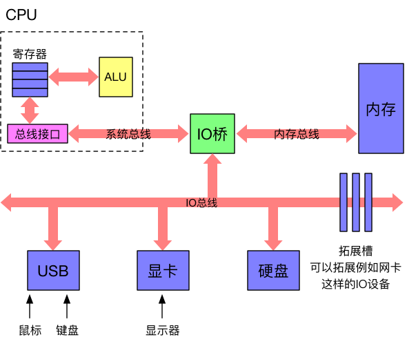
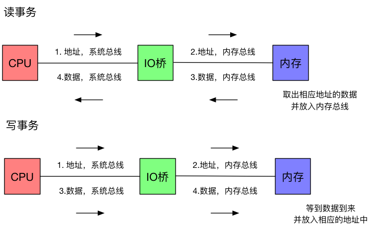
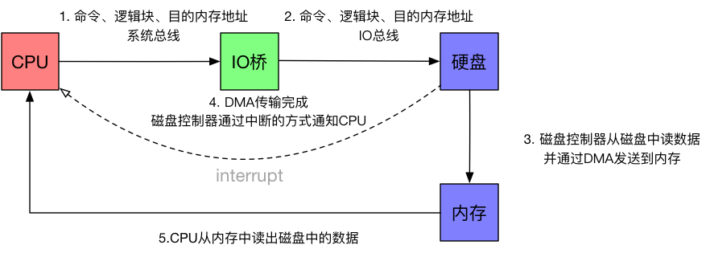
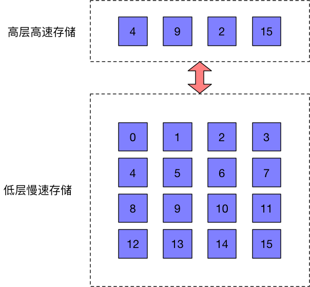
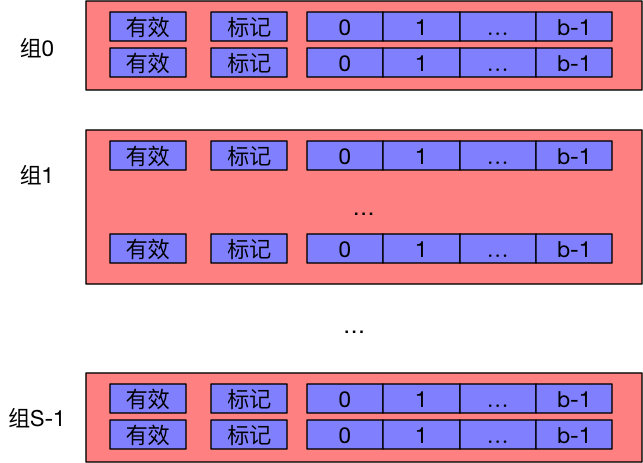

计算机的执行需要指令和数据，指令和数据必然也需要存储他们的地方，此篇内容就是来讲一下计算机中各种存储设备，看看他们的优缺点，再看看这些设备又是如何跟CPU交互的，最后我们会介绍缓存的相关知识。

# 存储体系金字塔
与计算相关的存储技术有很多，他们之间相互配合，取长补短用于计算机中的各个部分，就像下面的这个金字塔一样。

在金字塔越高层的地方，越接近CPU，这里的存储设备的速度越快，但是相应的成本也越高，空间也不会很大。同样的在金字塔往下的地方的存储设备的存取速度就会慢很多，成本便宜，也因此可以有很大的存储空间。这种存储层次体系合理的地方就在于：
* 高层存储可以看做是低层存储的缓存。
* 数据和指令使用是倾向于一种局部性，即不会同时使用全部的指令和数据。

基于这两点，这种存储体系就能很好将各种存储技术相结合，最终让CPU高效的处理运算，而减少由于存储存取设备速度慢导致CPU需要等待而出现的CPU资源浪费。此外，这个金字塔中的存储技术其实主要可以分为两类：随机存取存储和传统机械磁盘存储。

## 随机存取存储器
随机存储器(RAM)又可以分为两种类型：SRAM和DRAM，**SRAM的访问速度快，但是价格昂贵，一般会用于CPU中的高速缓存**，**DRAM的速度稍慢，但是价格便宜，通常都会用于内存**。从我们的金字塔中也可看到，SRAM被用于作为CPU中的三级缓存，而DRAM就被拿来作为内存了。但是，RAM也有一个缺点就是断电之后，数据是会丢失不被保存的。相应的就会有一种断电不丢数据存储，非易失存储器（ROM,Read-Only Memory)，虽然它乍眼一看是Read-Only,只读存储，只读不写，但是其实说起ROM基本都认为是一种可以读写的可持久化存储技术。例如，我们的手机、数码相机中的存储以及固态硬盘(SSD, Solid State Disk)都是基于闪存技术，它也是属于ROM范畴，而且还可以被读写。

## 传统机械磁盘
现在SSD虽然慢慢在抢占传统机械磁盘的位置，但是作为价格更加低廉，存储空间更大的机械磁盘也就还是有一席之地。磁盘是由多个盘片组成的，每个盘片的正反两面都覆盖这磁性材料，中间有一个可以旋转的主轴，一般会以5400~15000转每分钟的转速带动盘片旋转。盘片表面十分类似于树的年轮，每一圈年轮叫做磁道，磁盘又被划分为一组组的扇区，每个扇区都能包含相等数量数据（一般512字节)，就如下图所示：

最后将这一片片的磁盘和一个带有读写头的传动臂封装在一个密封的盒子内，就构成了一个磁盘驱动器，也就是俗称的硬盘。为了屏蔽这种机械结构的复杂性，现在磁盘还提供了一种**逻辑块**的概念，我们就可以通过逻辑块来访问具体数据了，逻辑块与数据的实际物理位置的映射就交给磁盘控制器去完成。可想而知这种纯粹的机械结构的存取速度根本不能和这些半导体存储相比的，硬盘和DRAM相比较慢了将近2500倍，和SRAM相比则甚至到了4万倍。但是好在我们可以有很多办法减少这种慢速设备带来的影响，传统的机械磁盘由于它的成本等特性，一段时间内也不可能被完全的替代。

# 总线
接着我们就来看看CPU是访问内存和磁盘中的指令和数据的。访问存储设备计算机会用到一种叫做总线的并行导线，总线就像是计算机中的高速公路，负责数据，指令，地址的传输通信。CPU与内存，磁盘等设备的交互必须要通过总线，才能将彼此连接起来，就像下图一样：

从图中我们也可以看到，总线有系统总线、内存总线、IO总线这几类。系统总线连接CPU和IO桥，内存总线连接IO桥与内存，IO总线是负责连接各种IO设备的，例如USB设备、显卡、磁盘驱动（硬盘）甚至是网卡这类的设备。然后我们深入了解一下CPU和内存的存取和磁盘的访问过程。
## CPU和内存的存取
每次CPU和内存来来回回的存取过程是通过总线的读事务和写事务完成的，就如字面意思一样，读事务将数据从内存中传送到CPU中，写事务是将数据传送到内存当中。下图就描述了读事务和写事务的过程：

* 读事务。CPU将地址通过系统总线发送给IO桥，IO桥再通过内存总线转发给内存，最后内存取出相应地址的数据并放入内存总线，通过IO桥，系统总线交给CPU。

* 写事务。同样的CPU也显示将地址发送到内存总线，这个时候内存从内存总线读出地址后，会等待相应的数据到来。之后CPU将数据再发送给内存，内存最后把数据放入相应地址的空间上。

## CPU和磁盘的访问
CPU访问磁盘等外围设备的数据都是通过IO总线完成的，在这里我们会大致描述一下当CPU从磁盘中读取数据的时候发生了什么。首先内存会用**内存映射**技术，简单说这个技术就是在虚拟内存地址空间内分配一块与磁盘相对应的地址空间，访问磁盘数据就可以像是访问内存一样。我们可以通过下图来了解这一过程：

首先CPU会将命令、逻辑块号、以及磁盘数据需要存放在内存什么地方的目的地址通过总线发送到硬盘上，也就是磁盘控制器上。磁盘控制器会解析这些信号并执行找到相应的数据，并通过DMA技术（直接将数据发送到内存，无需CPU等待并参与）将数据发送到目的内存地址的空间上。等到DMA执行完毕，即数据发送完毕之后，磁盘驱动器会发出一个CPU中断（图中虚线部分）通知CPU数据已经到达内存了，你可以通过访问内存来获得磁盘数据了，最后CPU就会执行内存访问获得具体的数据。这个便是CPU与磁盘的访问过程。

# 缓存
最后我们就来看缓存的部分，目的是知道计算机中的缓存是怎么一回事情。缓存的核心思想就是高层高速设备作为对低层慢速设备的缓冲，比如CPU中的高速缓存就是内存的缓冲，内存就是硬盘的缓冲，硬盘就是远程文件的缓冲等。低层设备是以**块（block）的形式**存储的，每一个快都有一个唯一的地址，类似的高层缓冲设备也是块的形式存储设备，但是却没有像低层设备这么多。因此说来，任何时刻缓存都只是保存低层存储数据副本的子集。我们以下图为例：

我们的低层设备分为了16个块，以0~15编号，我们的高层缓存只有4个块。可以看到我们只缓存了低层的4，9，2，15这几个块的数据。当程序需要访问低层的4号数据块的时候，由于缓存已经有了4号块，所以可以直接加载到CPU的寄存器中，而不是访问慢速的存储设备。如果说想要的数据不再缓存当中，这个时候就会产生缓存不命中，想要的缓存替换策略就起作用了，它需要决定哪一块被替换成新的，比如说LRU。缓冲不命中也分为这么几种情况：
* 冷不命中。一开始缓存中不缓存任何块，这个时候程序访问缓存肯定会出现不命中，这种不命中就称为冷不命中。
* 冲突不命中。底层设备块i总是存放在缓存的编号为`i mod k`块中，例如我们图中的0,4,8,12块总是放在缓存的0号块，1,5,9,13块放在缓存的1号块。因此如果程序请求0，然后请求4，然后又请求0，这样导致的不命中就叫做冲突不命中。
* 容量不命中。有时候我们的缓存太小，实际程序需要访问的数据超过这个容量，这个时候就会产生不命中，这种不命中被称为容量不命中。

## 高速缓存的组织结构
计算机中存储器地址都有$m$位，也就是$M=2^m$个不同的地址，高速缓存也不例外。此外，高速缓存还被分组管理，每组又可以分为好几行，一行中存放具体的缓存数据。如下图所示：

高速缓存中每一行被称为缓存行，每一行会用一个比特位来标记该行数据是否有效，用$t$位来标记辅助判断数据是否在缓存行中，以及剩下$b$位用来存放数据。与之相对应的便是内存地址也被划分成了三块：

标记位和缓存行的标记为都为$t$位，只有当标记位一致时说明数据在当前的缓存行内，组索引是用来确定当前地址的数据是被放在哪个组中的，行的确定是遍历找到的，最后块偏移就是用于确定数据在哪一个块的。上面的这种结构被称为高速缓存的通用结构，根据组内行的划分和组的划分还可以有三种不同的结构：
* 直接相连结构。每组只有一行缓存行，这种好处是组内无需遍历行来寻找数据，但是很容易造成冲突不命中。
* 组相连结构。和通用结构一致，能有效介绍冲突不命中的概率，但是需要额外的缓存替换策略。
* 全相连结构。缓存只有一组，这一组包含了所有的行，这种方式对于行遍历的性能要求极高，成本也是最高的一种。

到这里我们就大致讲解了一下什么是缓存，以及在高速缓存的结构。

# 总结
学习计算机中存储体系的知识，可以帮助我们在日后的编程的过程中，知道我们的数据是怎么在计算机中各个组件流动的，尤其是高速缓存的内容，当我们心中要高速缓存的知识的时候，便可以写出高速缓存友好的代码了，这种代码能够极好的提高程序的性能。