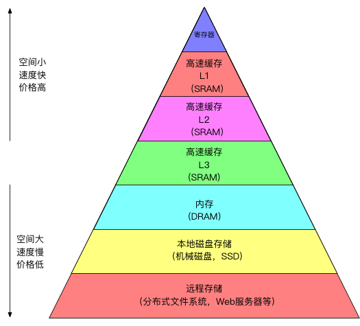

计算机的执行需要指令和数据，指令和数据必然也需要存储他们的地方，此篇内容就是来讲一下计算机中各种存储设备，看看他们的优缺点，再看看这些设备又是如何跟CPU交互的，最后我们会花大量的篇幅介绍缓存的相关知识。

# 存储体系金字塔
与计算相关的存储技术有很多，他们之间相互配合，取长补短用于计算机中的各个部分，就像下面的这个金字塔一样。

在金字塔越高层的地方，越接近CPU，这里的存储设备的速度越快，但是相应的成本也越高，空间也不会很大。同样的在金字塔往下的地方的存储设备的存取速度就会慢很多，成本便宜，也因此可以有很大的存储空间。这种存储层次体系合理的地方就在于：
* 高层存储可以看做是低层存储的缓存。
* 数据和指令使用是倾向于一种局部性，即不会同时使用全部的指令和数据。

基于这两点，这种存储体系就能很好将各种存储技术相结合，最终让CPU高效的处理运算，而减少由于存储存取设备速度慢导致CPU需要等待而出现的CPU资源浪费。此外，这个金字塔中的存储技术其实主要可以分为两类：随机存取存储和传统机械磁盘存储。

## 随机存取存储器
随机存储器(RAM)又可以分为两种类型：SRAM和DRAM，**SRAM的访问速度快，但是价格昂贵，一般会用于CPU中的高速缓存**，**DRAM的速度稍慢，但是价格便宜，通常都会用于内存**。从我们的金字塔中也可看到，SRAM被用于作为CPU中的三级缓存，而DRAM就被拿来作为内存了。但是，RAM也有一个缺点就是断电之后，数据是会丢失不被保存的。相应的就会有一种断电不丢数据存储，非易失存储器（ROM,Read-Only Memory)，虽然它乍眼一看是Read-Only,只读存储，只读不写，但是其实说起ROM基本都认为是一种可以读写的可持久化存储技术。例如，我们的手机、数码相机中的存储以及固态硬盘(SSD, Solid State Disk)都是基于闪存技术，它也是属于ROM范畴，而且还可以被读写。

## 传统机械磁盘
现在SSD虽然慢慢在抢占传统机械磁盘的位置，但是作为价格更加低廉，存储空间更大的机械磁盘也就还是有一席之地。磁盘是由多个盘片组成的，每个盘片的正反两面都覆盖这磁性材料，中间有一个可以旋转的主轴，一般会以5400~15000转每分钟的转速带动盘片旋转。盘片表面十分类似于树的年轮，每一圈年轮叫做磁道，磁盘又被划分为一组组的扇区，每个扇区都能包含相等数量数据（一般512字节)，就如下图所示：

最后将这一片片的磁盘和一个带有读写头的传动臂封装在一个密封的盒子内，就构成了一个磁盘驱动器，也就是俗称的硬盘。可想而知这种纯粹的机械结构的存取速度根本不能和这些半导体存储相比的，硬盘和DRAM相比较慢了将近2500倍，和SRAM相比则甚至到了4万倍。但是好在我们可以有很多办法减少这种慢速设备带来的影响，传统的机械磁盘由于它的成本等特性，一段时间内也不可能被完全的替代。

# 总线

# 高速缓存