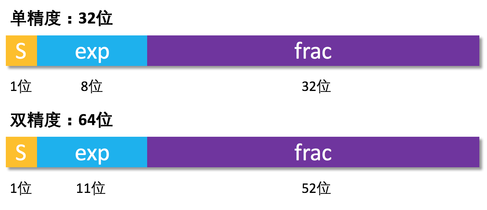
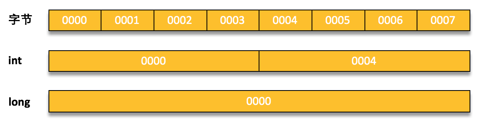
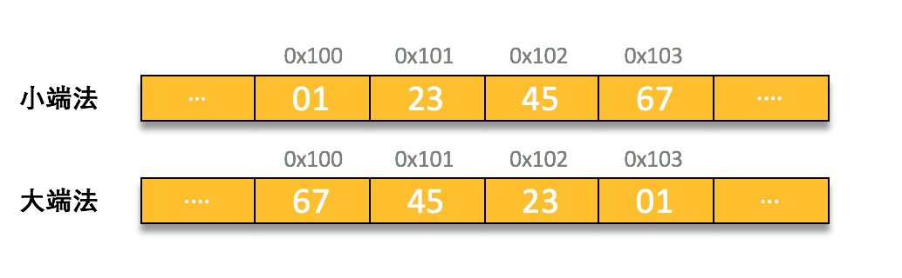

不理解计算机系统的本质，不理解程序是如何编译运行的，又怎么能够写好程序呢？下定决心要通过自底向上的方式来练内功，构建自己的知识体系，首先就先从永远不会离开的基础中的基础开始吧，来看看计算机中的整数和浮点数是怎么表示的已经他们又是怎样被存储的。

# 整数
在计算机中有两种表示整数的方式，一种是有符号数和无符号数，在这里准备一点点地抽丝剥茧，看看这种离我们最近地东西究竟是怎么样表示的又是转换的。首先要表示一个数我们需要假设一个数有w位，并且定义一个向量$\vec x = [x\_{w-1}, x\_{w-2}, \dots, x\_0]$表示整数的二进制格式，其中$x\_i$的取值为0或1。然后当使用不同解释方法时，该向量就可以解释成为无符号数和有符号数(补码数)。
* 无符号数
无符号数的解释相当的简单，我们可以定义一个$B2U\_w(\vec x)$方法，表示将w位的向量$\vec x$解释为无符号数:
$$ B2U\_w(\vec x) = \sum^{w-1}\_{i=0} x\_i \cdot 2^i $$

* 有符号(补码)
而有符号数的表示则需要引进一种叫做补码解释方法，简单讲就是将向量$\vec x$的最高位$x\_{w-1}$作为符号位，当值为1时表示为负数，值为0时表示为正数。具体的解释方法我们可以定义$B2T\_w(\vec x)$方法，表示将w位的向量$\vec x$解释为有符号数:
$$ B2T\_w(\vec x) = -x\_{w-1}\cdot2^{w-1} + \sum\_{i=0}^{w-2} x\_i \cdot 2^i $$
我们可以通过一个具体实例来看一下对同一个向量$\vec x$，这两种表示方式的有什么区别，他们具体对应的十进制数又是什么。

$\vec x$             | 无符号数($B2U\_w(\vec x)$) | 有符号数($B2T\_w(\vec x)$)
---------------------|---------------------------|-------------------------
$\vec x=[1,1,1,0]$   | $2^3+2^2+2^1=14$          | $-2^3+2^2+2^1=-2$
$\vec x=[1,1,1,1]$   | $2^3+2^2+2^1+2^0=15$      | $-2^3+2^2+2^1+2^0=-1$
可以很明显地看到对于同一个向量$\vec x$，两种整数的解释方式最终所表达的整数有明显的区别。也正是因为这两种解释方法的不同，它们的取值范围也不同，我们以w位数为例，可以定义下面这些常量表示取值范围:
* 无符号数的最小值，$Umin\_w = 0 $, 即$000\dots0$
* 无符号数的最大值，$Umax\_w = 2^w-1$,即$111\dots1$
* 有符号数的最小值, $Tmin\_w = -2^{w-1}$, 即$1000\dots0$
* 有符号数的最大值, $Tmax\_w = 2^{w-1}-1$, 即$0111\dots1$

不仅如此两种整数在做类型转换的时候会带来许多意想不到的问题，下面就来看看两者之间的转换怎样的。

## 无符号数和有符号数的转换
无符号数和有符号数的之间的转换，可能会导致数值的改变，但是具体的位模式是不会变的。简单来说就如上面的表格实例所表述的样子，无符号数14转换成有符号数就变成了-2,但是具体所对应的二进制表示（向量$\vec x$）却是同一个。我们可以通过一个更加数学化的方式来解释一下两者之间转换规则。
* 无符号数转换为有符号数:
对于满足$0\le x\le Umax\_w$的无符号数x有
$$ U2T\_w(x) =
\begin{cases}
x, & x\le Tmax\_w \newline
x-2^w,&  x > Tmax\_w
\end{cases}
$$

* 有符号数转换为无符号数:
对于满足$Tmin\_w \le x \le Tmax\_w$的有符号数有
$$ T2U\_w(x) = 
\begin{cases}
x+2^w, & x < 0 \newline
x, & x \ge 0
\end{cases}
$$

这些严格的数学表示也许在实际中不大会遇到，但是开发编码时两种类型的整数转换有时候却会带来问题。我们以C语言为例,在实际当中尤其需要注意整数藏式类型转换，例如会存在于：
* 一种类型的值赋给另一种类型,如
```c
int tx;
unsigned ux;
tx=ux; // 无符号转为有符号数
```
* 运算时一个运算数为有符号另一个运算数为无符号，则会藏式转换为无符号数。比如下面一段代码的问题就是由此带来的，可以先思考一下存在什么样的问题
```c
float sum_elements(float a[], unsigned length) {
    int i;
    float result = 0;
    for(i = 0; i <= length - 1; ++i) {
        result += a[i];
    }
    return result;
}
```
这段代码看似没有什么任何问题，但是我们可以设想一下，如果说传入的无符号参数length等于0,那么`length-1`相当于是0-1且由于length是无符号数，0-1得到结果是$Umax$，即无符号数的最大值。而且当在做`i <= length - 1`判断时候，根据上面的说的情况也都会转换成无符号数运算，那么`i <= length - 1`就必然永远为真，从而导致代码会方位数组a的非法元素。当然如果我们使用Java的话就不存在这一类问题了，Java的整数只有补码解释的有符号数，就不存在这种隐式转换了。

## 整数的扩展和截断
看完了整数两种表示和他们的转换，我们再来看看整数的拓展和截断，当然相应的我们需要分成无符号数和有符号数来表述。
* 无符号数的扩展和截断
无符号数的扩展又被称为零扩展，因为将无符号数扩展为一个更大的数据类型，仅仅就是在高位添加0。而无符号数的截断其实也就是从位模式上舍弃不要的位，例如将w位的无符号数截断位k位无符号数，$ k < w $,也就是将 x mod $2^k$的值。

* 有符号数的扩展和截断
有符号数扩展同无符号数一样，只是高位不是添加0而是添加符号位的数。有符号数的截断就相应的复杂了一点，我们以向量$\vec x$来表示无符号数的为模式，相应的截断操作需要这些步骤：
    1. 使用$B2U\_w(\vec x)$方法将数字转换为无符号数
    2. 对该无符号数做截断操作
    3. 再将截断结果转换为有符号数


## 整数的溢出
整数在运算过程中一旦在最高位发生了进位，就会导致溢出的情况发生，详细的去讲述溢出过程会花费大量的内容且知识点会十分的琐碎。在这里可以这样来学习这些知识点，**当整数计算过程发生了溢出情况，那么计算机只会保证有效位的数据**。例如一个无符号类型由3位来表示，那么它的取值范围在$[0,7]$，如果当一个表达式为`110+111(6+7)`的时候就会发生溢出`1101(13)`，计算机就会舍弃最高位的1保留3位有效位，最终的结果却是5反而比真实结果小了。

# 浮点数
说完了整数我们来看看计算机中的另一种数——浮点数，在计算机的世界中只有0和1，当我们用0和1的组合来表示浮点数我们并不能准确的表达一个数只能十分的接近于它，那么我就去看看计算机是如何表示浮点数，并着重地去解析IEEE的浮点数标准，此外还会去探究一下当一个数字不能被准确表示的时候我们是怎么处理舍入问题的。

## 二进制小数
理解浮点数第一步就是先去理解含有小数值的二进制数，二进制小数表示式如:
$$b\_m b\_{m-1} \dots b\_1 b\_0 . b\_{-1} \dots b\_{-n-1} b\_{-n}$$
其中$b\_i$的取值范围为0和1,通过这种形式表示的小数b可以定义如下:
$$ b=\sum\_{i=-n}^m 2^i \cdot b_i$$
例如，
$101.11\_2 = 1\cdot2^2+0\cdot2^1+1\cdot2^0+1\cdot2^{-1}+1\cdot2^{-2} = 
4+0+1+\frac{1}{2}+\frac{1}{4} = 5\frac{3}{4}$

$10.111\_2 = 1\cdot2^1+0\cdot2^0+1\cdot2^{-1}+1\cdot2^{-2}+1\cdot2^{-3} = 
2+\frac{1}{2}+\frac{1}{4}+\frac{1}{8} = 2\frac{7}{8}$

在这里也可以发现，二进制小数点向右移动一位相当于将该数乘以2。比如$1011.1\_2=11\frac{1}{2}$。此外像十进制表达法一样无法准确的表示$\frac{1}{3}$和$\frac{5}{7}$这样的数。二进制表示法也有局限，能够表示能够被写成$x \dot 2^y$的数，其他的数只能通过近似去表示。例如，数字$\frac{1}{5}$可以用十进制精确表示为0.2,但二进制表示法却不行，只能够提高表示的长度来逼近这个值的数。最后如果细心的小伙伴会想，那要怎么确定小数点的位置呢？其实就是采用定点法,意思就是规定w位的数，其中前n位表示的整数部分，后w-n为用于表示小数部分。但这样子就会有一个问题，无法表示很大的数或者又无法表示很精度很高的数，那么为了解决这种的窘境我们就看看下面的IEEE浮点数标准是如何表示浮点数的。

## IEEE浮点数标准
IEEE 的浮点数标准更多是从数值角度来建立的，在我看来这就是解决表示范围和表示精度的问题，此外还统一了舍入，上下溢出的处理方法；但是IEEE标准理解起来并不是很直观，还是需要我们细心的去思考掌握。标准采用以下方式来表示一个数
$$V=(-1)^s\cdot M \cdot 2^E$$
其中s就是符号位，1表示负数，0表示负数；M是一个二进制的小数，范围在$[1,2)$或者$[0,1)$之间，被称作尾数；E是次方数，称作阶码。然后我们对着三部分进行编码：
* 1位单独的符号位s
* k位的$exp=e\_{k-1}\dots e\_1e\_0$，用于计算阶码E
* n位的$frac=f\_{n-1}\dots f\_1f\_2$，用于计算尾数M

下图可以看到常见的格式（单精度和双精度）

在理解的时候一定要注意！**exp不一定等于阶码E，frac也不一定等于尾数M,E和M是通过exp和frac计算得出的**，记住这一点可以帮助后面内容的理解。然后我们就来看看这个标准到底是如何来表示浮点数的。

### 规格化的值
当$exp \ne 000\dots0$或$exp \ne 111\dots1$,即位模式不全等于0或者不全等于0时，那么这样一个值就是一个规格化的值。那么根据IEEE标准的数的表示法，我们需要去计算`阶码E`和`尾数M`。在这里我们需要引入一个偏移量用于计算阶码E，
$$Bias = 2^{k-1}-1$$
在有了这个偏移量后，我们就可以去具体的计算阶码和尾数了。
* 阶码的计算方式如下：
$$Exp = B2U(exp)=\sum\_{i=0}^{k-1} b\_i\cdot2^i$$
$$E = Exp - Bias = \sum\_{i=0}^{k-1} b\_i\cdot2^i - (2^{k-1}-1)$$
我们要需先计算exp段的无符号数`Exp`，然后将值`Exp`减去偏移量`Bias`最终得到阶码E。
* 尾数的计算
规格化值的尾数就是一个采用**定点法的二进制小数**,规定了整数位是1位且值一定是1，也就是说$M=1.xxxxx\dots xxx$。因此说来frac部分值就被用来表示小数部分，那么尾数的M的计算就可以如下表达：
$$M=1 + \sum\_{i=-1}^{-n} b\_i \cdot 2^i$$
举个例子单精度浮点数的例子,可以看到exp符合规格化值的约定，所以我们按照规格化方式去计算。
```
0 10001100 11011011011010000000000
s   exp         frac
```
先计算偏移量和阶码E:
$$Bias = 2^{k-1}-1 = 2^{8-1}-1=127$$
$$Exp = B2U(exp)=\sum\_{i=0}^{k-1} b\_i\cdot2^i=128+8+4=140$$
$$E = Exp - Bias = 140-127 = 13$$

接着我们就可以来计算尾数了:
$$M=1 + \sum\_{i=-1}^{-n} b\_i \cdot 2^i=1+\frac{7020}{8192}$$
最后我们就可以利用公式$V=(-1)^s\cdot M \cdot 2^E$计算出具体的值了。

### 非规格化的值
接着我们讲一下非规格化的值，当$exp = 000\dots0$，即exp全部为0的时候，那么这样一个值就是非规格化的值。非规格化的值与规格化的值略有不同，只要在于阶码和尾数的计算方式上面。
* 阶码的计算
$$E = 1 - Bias = 1 - (2^{k-1}-1)$$
可以看到这里不再需要去计算exp的无符号表达的值了。
* 尾数的计算
同规格化值一样，尾数采用的也是定点法的二进制小数，只不过整数位值一定是0而不是1，也就是说$M=0.xxxxx\dots xx$了。因此具体的尾数计算公式就变为了
$$M = \sum\_{i=-1}^{-n} b\_i\cdot2^i$$

### 特殊值
讲完了上面两种情况，我们还剩下$exp = 111\dots1$，即exp全部为1的情况。在这种情况下，这些值都是一些特殊值。而具体表示特殊值需要根据frac中值来决定。
* $frac \ne 000\dots00$，frac不全为0
我们认为这样的一个值**不是一个数字(Not-a-Number, NaN)**，用来表示那些没办法确定的值，比如 sqrt(−1),$\infty-\infty$。

* $frac = 000\dots00$, frac全为0
这个时候这些值表示为$\infty$，又由于有符号位的存在还可以细化为$+\infty$和$-\infty$。

## 浮点数的舍入
来到浮点数的舍入这一块，我们来所说为什么需要浮点数舍入。因为浮点数由于表示方式只能表达一个近似值,那么就需要用一种系统的方法来舍入值，使得舍入结果量可能的接近精确值。主流的舍入方法有四种，向偶数舍入、想零舍入、向下舍入、向上舍入，而在IEEE标准中默认使用的是向偶数舍入，具体来说就是舍入到最近的偶数，即如果出现在中间的情况，舍入之后最右边的值要是偶数。我们可以以十进制为例：
```
  原数值       舍入结果    原因
2.8949999      2.89    不到一半，正常四舍五入
2.8950001      2.90    超过一般，正常四舍五入
2.8950000      2.90    刚好在一半时，保证最后一位是偶数，所以向上舍入
2.8850000      2.88    刚好在一半时，保证最后一位是偶数，所以向下舍入
```

# 数据的存储
最后让我们看看数据的存储问题，我们知道一种类型的数据会占用不同个数字节，那么我们核心的问题就是**理解它们有用什么方法来安排占用字节的顺序和用什么方式来表示具体类型数据的地址**。其实每个机器级程序（进程）所看到的内存都是操作系统所分配的虚拟内存，它们只能访问自己的内存空间而不能访问其他进程的内存空间。这样的虚拟内存有一个好处，就是保证了进程所看到的内存地址是连续的，而对应的物理内存却不一定。每一类具体的数据会占用不同字节，每个字节都有一个地址来唯一标识，一个数据的地址就是**所占用字节的第一个字节的地址**，我们以4字节（32位）的int类型和8字节(64位）long类型为例，可以看到它们分别占用了哪些字节，以及它们都用第一字节的地址作为自己地址。


## 大端与小端规则
安排占用字节的排列方式有两种：大端法(Big Endian)和小端法(Little Endian)，区别就在于第一个字节存放的是最高有效位还是最低有效位。最低有效位在前的是小端法，最高有效位在前的是大端法，十分相当的好理解。举个例子，我们假设变量x为int类型，地址为`0x100`，它的十六进制值为`0x01234567`，可以明显的看出他们的区别。

基本上大多数的Intel兼容机都只用小端模式，也就是说我们常见的 x86 或 ARM 处理器都采用小端规则。

# 总结
讲了这么多我们来总结以下，要了解整数和浮点数的细节大部分时候对实际工作没有什么太大的影响，但是作为构建们知识体系过程中是最最基础的部分，它们不可或缺。需要掌握的就是它们在计算机中是如何的表示的，无符号数和有符号数的转换，整数扩展截断溢出的处理方式；二进制小数，，IEEE浮点数的标准；以及这些数据是如何存放在我们的内存当中的。士不可以不弘毅，任重而道远，让我们继续往下走吧。