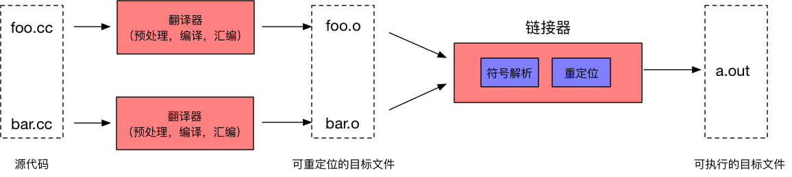
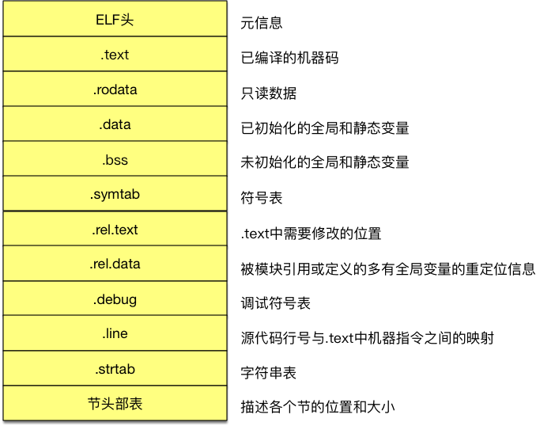
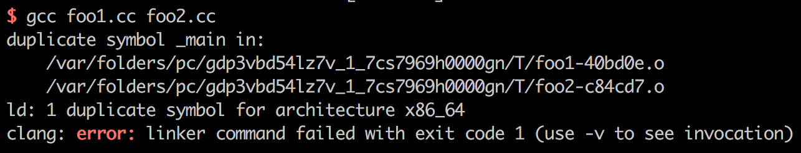
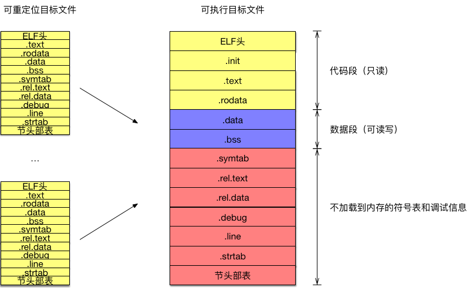
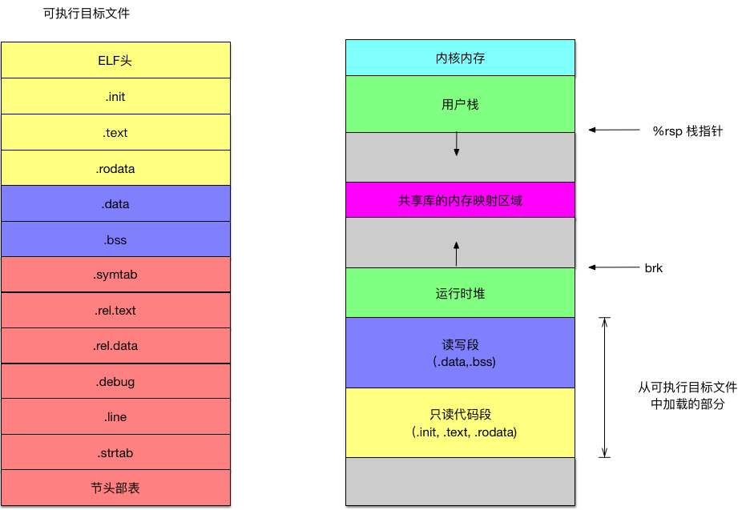

源代码需要经过编译和链接两大步骤才能转换成计算机可以执行的机器码。因此了解链接的过程也有助于我们构建自己的知识体系，可以明白什么是链接，什么是动态库和静态库，以及什么是可重定位的目标文件等等。

# 链接器
链接的核心目的就是将各个各种代码和数据片段合并起来成为一个文件的过程。例如我们最简单的`Hello World`程序
```c
#include <stdio.h>

int main(){
    printf("%s\n", "hello world");
    return 0;
}
```
它调用了`printf()`函数，但是在经过汇编器处理之后生成的`hello.o`文件中并没有包含`printf`函数相关的代码，而仅仅是一个**符号引用**罢了，那要让`hello world`程序最后能够执行就需要经过链接，把`printf`的定义和引用相关联，组合成一个文件。最终这一个文件才能被加载到内存当中用于后续的执行。链接在早期的计算机中还是需要手动执行的，但是到了现代系统中，链接都是交由链接器去完成的。链接器从宏观看起来就像是这样:

我们的源代码在经过预处理、编译、汇编之后会转换成**可重定位的目标文件**，链接器会把这些文件经过符号解析和重定位过程组合在一起生成一个**可执行的目标文件**，这个文件就可以直接加载到内存中运行了。正是因为有了链接器的存在，便可以让我们进行**分离编译**开发了，把哪些公共的部分抽象出来，单独放在一个模块中，需要用的时候再通过链接器把他们串联在一起。在需要修改的时候也只需要修改模块本身然后编译即可，而不用编译其他的文件，这便是链接器的目的——分离编译。

## 链接的时机
链接的过程可以是在**编译的**时候，可以是在程序**加载**到内存的时候，甚至可以在程序**运行**的时候。因此我们便将在编译时期的链接过程称为静态链接，而在加载和运行时期的链接则被称为动态链接。与之相对应的便是静态链接器和动态链接器，静态链接器的过程就像是上图一样，而动态链接会涉及到加载器的部分，我们会在后续介绍。

# 目标文件
在我们链接过程的前后都涉及到了目标文件，因此我们有必要先去了解一下目标文件知识。目标文件可以分为三类：
* 可重定位的目标文件。包含二进制的代码和数据，可以与其他可重定位目标文件组合起来形成一个可执行的目标文件。
* 可执行的目标文件。包含二进制的代码和数据，可以直接被加载到内存并执行。
* 共享目标文件。一种特殊的可重定位的目标文件，可以在加载和运行期间被动态地加载到内存。

目标文件最终都是以一种格式存放在磁盘当中的，在Linux和Unix的操作系统中是采用**可执行可链接格式(ELF, Executable and Linkable Format)**存放目标文件的。下图就是展示了**可重定位目标文件**的ELF格式：

在图中每一小格都被称为节，每个节都有它自己的用途。例如.text节就是放了编译好的机器码，.rodata存放了只读数据，以及.symtab保存的是符号表。在这里我们主要来关注一下符号表这一节，这一块的内容涉及到了符号解析的过程，因此有必要着重看一下。

## 符号
符号其实就是我们代码里的各种变量和函数的名字，在链接器的视角来说，一共有三种类型的符号：
* 全局符号。由模块自身定义并可以被其他模块引用的符号，对应于本源码文件中的非静态的C函数和全局变量。
* 外部符号。由其他模块定义并被模块自身引用的符号，对应于其他源码文件中定义的非静态C函数和全局变量。
* 局部符号。本模块定义和引用的符号，对应于带static属性的C函数和静态变量。

> static关键字在C中的含义其实和Java中的private关键字类似，写了static关键字的全局变量或者函数，支对模块（文件）可见，其他模块是不能引用这些函数和全局变量的。

## 符号表
符号表就是描述符号的集合，符号表就是一个包含**条目**的数组，条目就是一个用来**描述符号**的数据结构，条目的格式如下：
```c
typedef struct {
    int name;       // 字符表的偏移量
    char type:4;    // 函数符号或数据符号
    char binding:4; // 局部或全局
    char reserved; 
    short section;  // 符号所在的节
    long value;     // 符号地址
    long size;      // 目标的大小
}Elf64_Symbol;
```
可以看到这个数据就是用来描述符号的，比如其中`name`字段就是表明了这个符号叫什么名字，`type`指出该符号变量的符号还是函数的符号。`section`字段是用来描述这个符号是在哪一节的，例如一个函数的符号的`section`就会指向`.text`这一节，除此之外`section`还会有三个特殊的值:`ABS`代表不该被重定位的符号；`UNDEF`代表未定义的符号，也就是在本目标文件中引用，但是却在其他目标文件中定义的符号；`COMMON`代表还未被分配位置的未初始化的数据。简单来说要理解符号表，记住一条就是符号表是一个描述目标文件中符号的数组即可。

# 静态链接
静态链接就是在编译期间将各个目标组合在一起的过过程，这个过程可以分为两个步骤：符号解析和重定位。

## 符号解析
符号解析的目的就是将每个符号的引用和它输入的可重定位目标文件的符号表中的一个确定的符号定义关联起来。简而言之就是理清楚符号定义与符号引用的关系，将他们对应起来。局部符号是最容易解析的，因为它们的定义和引用都在同一个目标文件内。但是如果是全局符号或者是外部符号这个时候，就会涉及到一个同名问题，如过个模块定义了同名的符号，这个时候链接器就需要去决定使用哪一个了。在Linux中，符号会被分成**强符号**和**弱符号**，强符号是函数和已初始化的全局变量，未初始化的全局变量就是弱符号。在链接的过程中会遵循以下的规则：
1. 不允许有多个同名的强符号。
2. 如果有一个强符号和多个弱符号同名，则选择强符号。
3. 如果有多个弱符号同名，则随机选择一个。

例如，我们编译链接下面两个C模块
```c
// foo1.c
int main() {
    return 0;
}

// foo2.c
int main() {
    return 0;
}
```
可想而知这是无法通过编译链接的，就会输出这样的错误：

因为有两个名字都为main的强符号，链接无法执行而终止。

## 静态库
链接的过程试讲各个目标文件组合在一起，但是有时候最终程序只用到目标文件中的一部分的代码，可却把所有目标文件都组合在了一起，这就导致了磁盘占用空间的增大亦或是内存的浪费。因此静态链接通常会涉及到静态库，静态库就是一系列可重定位目标文件的集合，在Linux中会以`.a`结尾，这些文件都是静态链接库。静态库的好处就是：程序员不需要显式的指定所有需要链接的目标模块，因为指定是一个耗时且容易出错的过程；链接时，连接程序只从静态库中拷贝被程序引用的目标模块，这样就减小了可执行文件在磁盘和内存中的大小。静态链接的过程主要有两部分：符号解析和重定位。例如我们现在有这么两个C模块，
```c
// multvec.c
int multcnt = 0;

void multvec(int *x, int *y, int *z, int n) {
  int i;
  multcnt++;
  for (i = 0; i < n; i++) {
    z[i] = x[i] * y[i];
  }
}

// addvec.c
int addcnt = 0;

void addvec(int *x, int *y, int *z, int n) {
  int i;
  addcnt++;
  for (i = 0; i < n; i++) {
    z[i] = x[i] + y[i];
  }
}
```
我们可以先编译得到相应的可重定位的目标文件，然后通过`ar`命令将他们打包成一个静态库。
```shell
linux> gcc -c addvec.c multvec.c    # 编译
linux> ar rcs libvector.a addvec.o multvec.o # 打包
```
最后我们就会得到打包好的可用于静态链接的静态库。

## 重定位
当我们的可重定位的目标文件执行了符号解析，符号定义与引用直接的关系明确之后，就需要执行可重定位流程了，简而言之就下图这样：

把所有输入的可重定位目标文件组合成一个可执行的目标文件。在这个过程中，链接器会先
1. 把各个可重定位目标文件相同的节合并，并给它们一个运行时的内存地址，包括符号定义的地方也会分配一个内存地址；
2. 然后符号定义的地址赋给它们引用的地方。
通过这两步最终形成一个可执行的目标文件。我们仔细观察一下这个可执行目标文件的ELF格式，发现会有一个`.init`节，这一部分定义了一个叫做`_init`函数，在程序初始化的时候回调用它。

# 加载器
最后这个可执行的目标文件，就会通过加载器(loader)加载到内存当中，在这里我仅仅需要了解程序在内存中的模型即可。

从图中可以看到可执行目标文件中的黄色和蓝色部分会被加载到内存部分，作为代码段和数据段。以及在内存还会出现用户栈和运行时可分配的内存空间——堆，这些部分组成了一个程序运行的上下文。

# 动态链接
最后来说一下动态链接，在静态链接过程中还是会把很多公用的部分复制到可执行的目标文件中，例如`printf`，`scanf`这一类的。动态链接就是为了解决这一问题而实现。动态链接会使用共享库（shared library)，共享库就是一个目标模块，在运行或者加载的时候，可以加载到内存的任意位置，并和需要这个共享库的程序链接起来。具体程序在调用的时候就会调用这一块的代码，因此这些共享的部分在内存中只占有一部分空间，而不是像之前分布在不同的内存空间中，造成资源的浪费。共享库在Linux都是`.so`结尾的，动态链接库只提供符号表和其他少量信息用于保证所有符号引用都有定义，保证编译顺利通过。动态链接器(ld-linux.so)链接程序在运行过程中根据记录的共享对象的符号定义来动态加载共享库，然后完成重定位。

# 总结
以上便是链接的知识点，此篇内容还是作为笔记向的内容，帮助自己构架知识体系。

