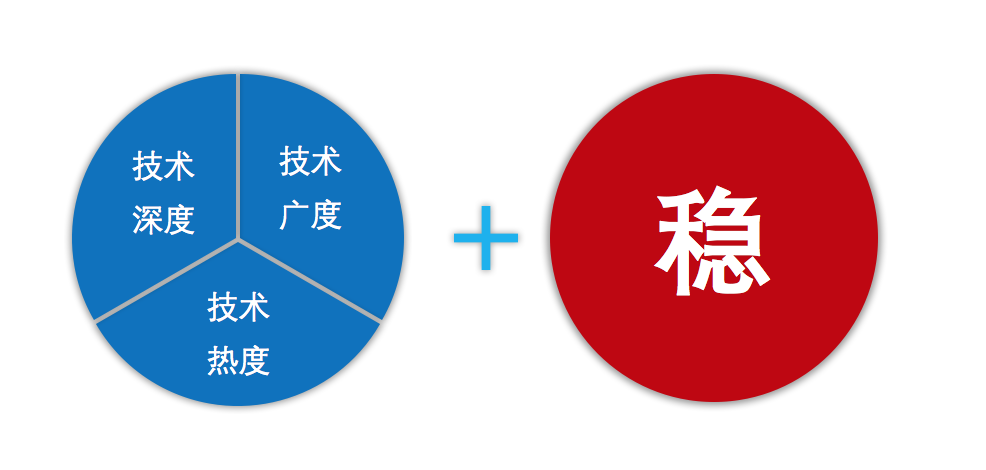

阿里的暑期实习结束，最终却没有转正成功，当初自信满满的进入阿里，认为这里就是可以实现自己梦想的地方，如果哪里可以让自己用技术改变世界，就应该是这个地方。但是最后很可惜没有留下来，主管说是我的运气比较差，没有时间辅导，转正面试的过程中，太过于叙述技术细节了，却没有一个大局观，让人面试官听的不明所以，逻辑混乱。听起来是因为自己运气不好，面试用错了套路，所以才没有转正。但是，反过来思考一番,我真的够格了吗？

# 阿里需要什么样的人

首先我便在想阿里需要的是什么样的人，主管一直在说阿里需要找的是技术上符合三度的人才，也就是掌握技术的深度，了解技术知识的广度，以及热爱技术的程度。但是思考之后发现，其实不仅如此，阿里还需要的人还必须**稳重**，什么意思？因为阿里的产品，支付宝、淘宝、天猫等等，它们已经成为了一个生活必需品，生活必需品是什么，就是它的一点点小毛病都会被无限的放大，造成极大影响。如果我们这些做开发的不稳重，做事的时候没有一个清晰的逻辑，良好的大局观，往往都会带来问题，导致上千上亿的资损。这就是为什么，我没有转正的一个重要因素，因为我的面试完全没有让面试官明白到我的演讲逻辑和大局，从而判断我也许不是很稳重。

# 在稳方面欠缺什么
那么我在稳这一个方面还欠缺一些什么呢，撇开运气因素不说，毕竟在阿里要时刻拥抱变化，必然时刻准备某一刻的到来，例如转正面试。感觉首当其冲的便是，没有进行阶段性的自我思考和总结，当事情要来的时候才开始仓促地着手准备，那么必然是来不及的。第二点便是自己还需要加强自己的**主动**沟通能力，没有师兄，师兄很忙，师兄很空但却没有安排事情。这个时候，我就必须主动与其他人沟通交流，自己去创造师兄，自己创造任务出来，也正是因为沟通才能让自己了解更多的东西，从而可以在宏观大局上有一个掌握。

# 在技术方面欠缺什么
讲了这么多做人处事，最后在回到技术，那么我在技术上还欠缺着什么？这个答案其实很简单，就两个字**系统**。我学了这么多，看了这么多，在其他人眼里也许我很厉害，知道的好多。但是我却没有把这么多知识都成系统体系的消化吸收，掌握的内容就像是拼图，一片又一片，没有把它们拼起来组成一幅大的画。因此说来，我又需要怎么在技术上沉淀自己呢：
*  温故知新，查漏补缺
必不可少的就是温故知新，首先我要回顾总结自己会的知识，把自己掌握的知识拼成一副大图，形成一个系统。同时在回顾总结的过程中，发现自己遗漏的部分，让自己不再是一个纸篓，而是一个铁桶。

* 偏向底层，学习思想
偏向底层便是我的兴趣方向了，计算机的内部是美妙的，我还需要一点点抽丝剥茧，发现其中的美了。此外，还就是要学习思想，学习设计思想，这个架构为什么这么做，接口为什么又这么设计，什么又是面向领域驱动设计，都还需要我去一个个攻克。最后，也祝愿自己不忘初心，坚持到底，不会倒在实现梦想的路上。

